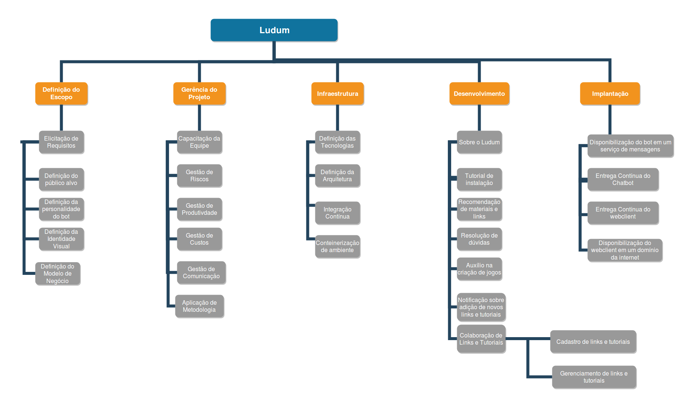
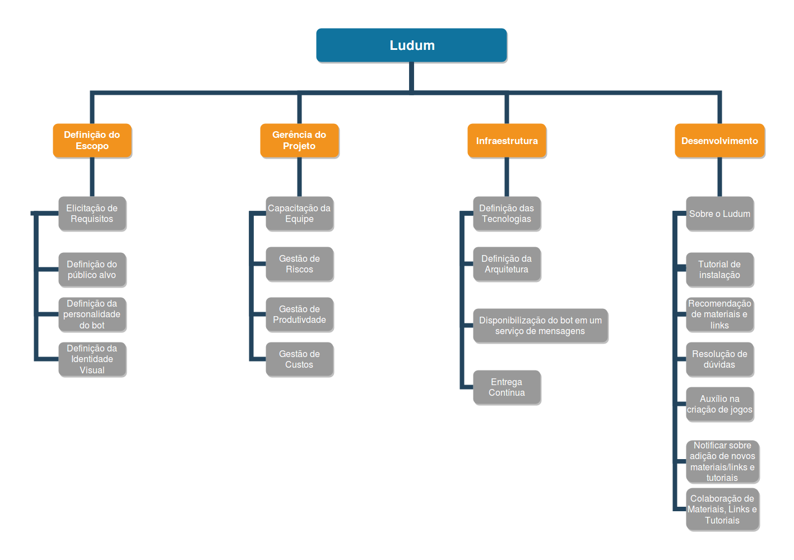
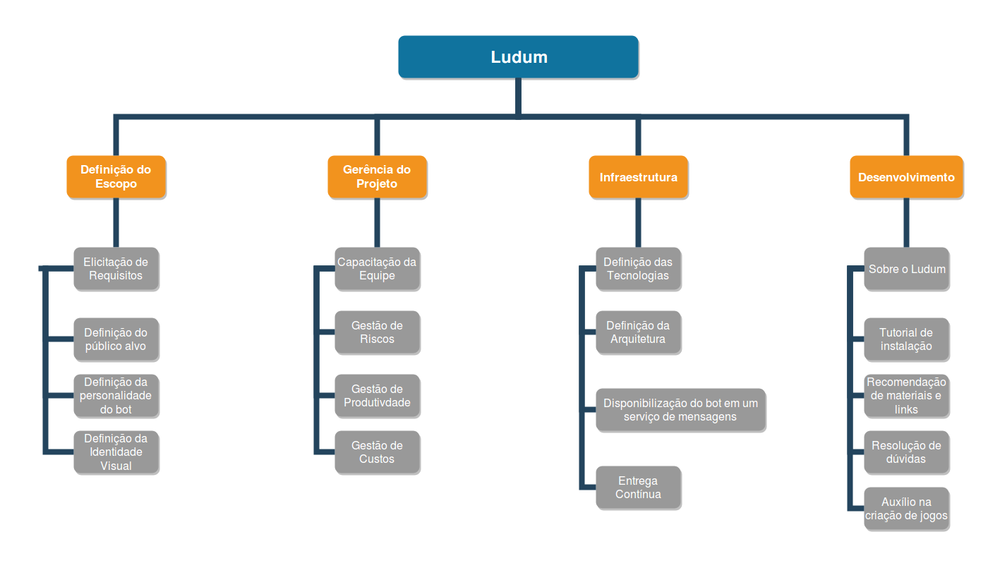

# Histórico de Versão

 **Data** | **Versão** | **Descrição** | **Autor(es)**
---|:---:|---|---
31/03/2019| 0.1| Criação da primeira versão da EAP| Gabriela, Guilherme e Lucas Lermen
02/04/2019| 0.2| Segunda versão da EAP| Gabriela Moraes
02/05/2019| 0.3| Terceira versão da EAP| Gabriela Moraes
21/06/2019| 0.4| Quarta versão da EAP| Gabriela Moraes e Lucas Lermen

# Sobre a EAP

Segundo o PMBOK 5ª edição, a Estrutura Analítica do Projeto (EAP) é “O processo de subdivisão das entregas e do trabalho do projeto em componentes menores e mais facilmente gerenciáveis.” .

# Quarta Versão
Autores: Gabriela Moraes e Lucas Lermen.

# Terceira Versão
Autores: Gabriela Moraes.

# Segunda Versão
Autores: Gabriela Moraes.

# Primeira Versão
Autores: Gabriela, Guilherme e Lucas Lermen

# Referências
> PMI. Um guia do conhecimento em gerenciamento de projetos. Guia PMBOK 5a. ed. - EUA: Project Management Institute, 2013.