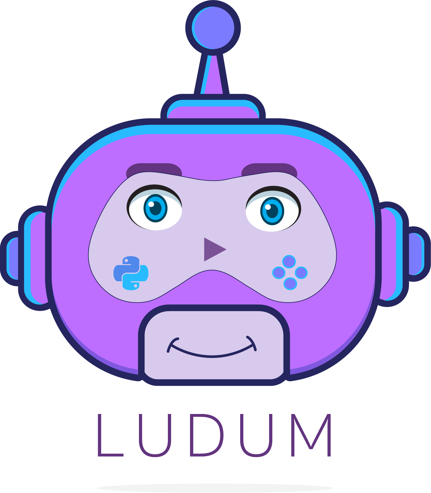

<p align="center">  
<br>    
<a href="https://www.gnu.org/licenses/gpl-3.0.pt-br.html"></a> <a href="CODE_OF_CONDUCT.md"></a> 
<a href="https://gitlab.com/guilhermesiqueira/2019-1-Ludum/commits/development"></a>
<a href="https://codeclimate.com/github/fga-eps-mds/2019.1-Ludum/maintainability"></a>
<br><br> <b><a href="https://t.me/OLudumBot">Clique aqui para conversar comigo no Telegram!</a></b> 
<br> Se não conseguir me encontre pelo meu username é <b>@OLudumBot</b>
<br> Ah! Eu também possuo uma versão de homologação é <a href="https://t.me/ludumdev_bot">@ludumdev_bot</a></b>
</p>

# Ludum - O assistente virtual sobre o PyGame

## Sobre
<p align="justify">O Ludum é um chatbot que propõe-se a auxiliar em diversos aspectos as pessoas que desejam desenvolver jogos utilizando a biblioteca PyGame.</p>

## Principais funcionalidades
* **Sobre o Ludum** - o Ludum explicará tudo que ele pode fazer;
* **Resolução de dúvidas** - o Ludum mostrará as perguntas frequentes relacionadas à PyGame e caso o usuário não encontre ele pesquisará no Stack Overflow;
* **Recomendação de materiais e links** - o Ludum irá recomendar materiais e links que contribuam ao aprendizado do usuário;
* **Contribuição pela Comunidade** - A comunidade usuária pode contribuir ao Ludum com materiais e links, além de tutoriais de jogos utilizando a PyGame;
* **Auxílio na criação de jogos** - o Ludum ensinará como desenvolver jogos com complexidades variadas utilizando a PyGame, além de fornecer algumas recomendações de configurações de ambiente, caso o usuário precise.

## Tecnologias
* **Python3** - Linguagem de programação utilizada para codificar o core do bot;
* **Rasa** - Tecnologia de Inteligência Artificial para o ChatBot;
* **NodeJS** - Node.js é um interpretador de código JavaScript com o código aberto, focado em migrar o Javascript do lado do cliente para servidores;
* **MongoDB** - Banco de dados não relacional utilizado no projeto;
* **Docker** - Ferramenta para criação e administração de ambientes isolados;
* **GitLab CI** - Ferramenta responsável pelo integração contínua e deploy contínuo;
* **Rancher** - É uma uma plataforma opensource para gerenciar infraestrutura de Docker e Kubernetes em produção, assim como efetuar deploy de apps usando Docker. O deploy pode ser local ou em servers remotos (Digital Ocean, AWS, etc).

## Documentação
Os arquivos da documentação do projeto estão localizados na pasta `docs` e para visualizá-los basta acessar o nosso GitHub Pages disponível em https://fga-eps-mds.github.io/2019.1-Ludum/#/.
<p>Toda a estrutura de repositórios se encontra em nossa organização. Conheça mais <a href="https://github.com/botludum">clicando aqui.</a></p>

## Quero ajudar! Como contribuir?
<p align="justify"> Sua ajuda é muito bem vinda! O guia com todos os passos para contribuir ao Ludum se encontra <a href="https://github.com/fga-eps-mds/2019.1-Ludum/blob/development/CONTRIBUTING.md">aqui</a> e não esqueça de seguir nosso código de conduta, para conferir basta clicar <a href="https://github.com/fga-eps-mds/2019.1-Ludum/blob/master/CODE_OF_CONDUCT.md">aqui</a>.</p>

## Como executar o Ludum
1. Abra um terminal dentro do repositório clonado do Ludum
2. Digite no terminal:
```bash
docker-compose run --rm ludum make train
```
para treinar o bot e instalar dependências necessárias. Deixe este terminal aberto!
3. Após, baixe o [ngrok](https://ngrok.com/download) e abra um outro terminal dentro do diretório em que se encontra o ngrok
4. Neste terminal, digite:
```bash
./ngrok http 5001
```
5. Copie o webhook fornecido e cole na linha relativa a webhook_url, no arquivo credentials.yml, localizado em rasa/credentials.yml;
6. Copie o token e cole em access_token também dentro do credentials.yml;
7. No terminal que foi aberto no passo 2, agora digite:
```bash
docker-compose up telegram_bot
```
para rodar o bot no Telegram.Após isso, o bot já está online e pronto pra ser testado no Telegram.
Caso queria rodar o bot na linha de comando, digite:
```bash
docker-compose run --rm ludum make run-console
```

## Contribuidores
### Equipe
**Nome**|**Papel**| **GitHub**
:--:|:--:|:--:
Gabriela Chaves de Moraes| Product Manager| [gabrielademoraes](https://github.com/gabrielademoraes)
Guilherme Siqueira| DevOps| [guilhermesiqueira](https://github.com/guilhermesiqueira)
Lucas Lermen| Tech Leader| [LucasLermen](https://github.com/LucasLermen)
Lucas Penido| Arquiteto de Software| [LucasPenido](https://github.com/LucasPenido)
Lucas Ganda| Desenvolvedor| [lucasgandac](https://github.com/lucasgandac)
João de Asssis| Desenvolvedor| [jonjon667](https://github.com/jonjon667)
João Pedro Correia| Desenvolvedor| [jprcorreia](https://github.com/jprcorreia)
Thallys Silva Braz| Desenvolvedor| [thallysbraz](https://github.com/thallysbraz)
Wictor Bastos Girardi| Desenvolvedor| [Wictorgirardi](https://github.com/Wictorgirardi)

## Licença
<p align="justify"> Esse projeto utiliza a licença GPLv3.0. Para mais informações <a href="https://github.com/fga-eps-mds/2019.1-Ludum/blob/master/LICENSE">clique aqui</a></p>
