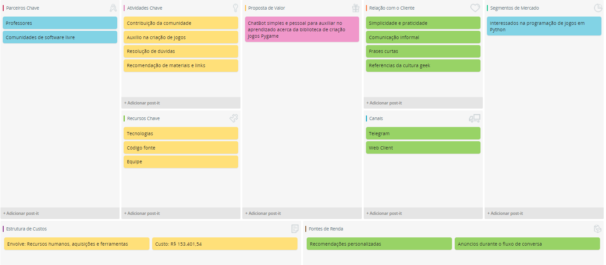

# Histórico de Versão

 **Data** | **Versão** | **Descrição** | **Autor(es)**
---|---|---|---
01/04/2019 | 0.1 | Iniciação do documento | Todos (EPS)
20/06/2019 | 0.2 | Criação da segunda versão | Gabriela e Lucas Lermen

# Canvas do Projeto

## Versão 2

## Versão 1

## Ferramenta utilizada

[Sebrae Canvas](https://m.sebrae.com.br/sites/PortalSebrae/solucoes_online/ferramenta-canvas-online-e-gratuita,a833848578f80510VgnVCM1000004c00210aRCRD)

# Referências
> ABSTARTUPS. Quer aplicar o Business Model Canvas? Veja alguns exemplos. Disponível em: https://abstartups.com.br/quer-aplicar-o-business-model-canvas-veja-alguns-exemplos/

> TAKE. Como usar chatbots: as 5 melhores formas para gerar receita para a empresa. Disponível em: https://take.net/blog/chatbots/como-usar-chatbots/

> SEBRAE. Canvas: como estruturar seu modelo de negócio . Disponível em: http://www.sebrae.com.br/sites/PortalSebrae/ufs/mt/artigos/canvas-como-estruturar-seu-modelo-de-negocio,6a5cc221fcc3a510VgnVCM1000004c00210aRCRD