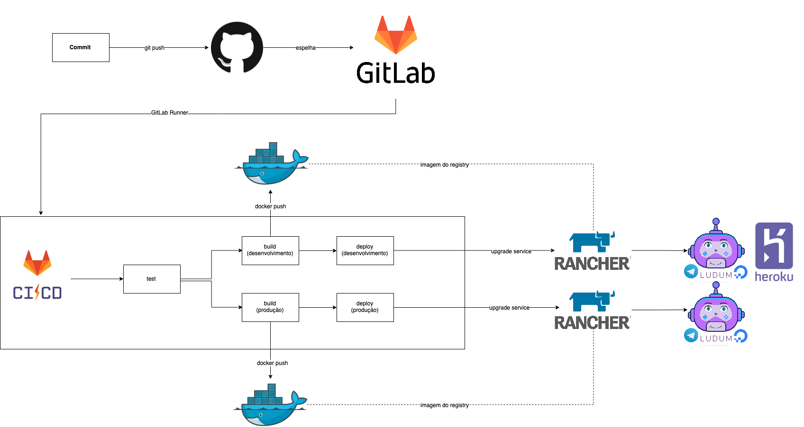

# Histórico de Versão

 **Data** | **Versão** | **Descrição** | **Autor(es)**
---|---|---|---
15/04/2019 | 0.1 | Documentado pipeline do projeto até integração contínua | Guilherme Siqueira e Lucas Penido
20/06/2019 | 0.2 | Refatorando documento | Guilherme Siqueira

# Integração Contínua e Deploy Contínuo

A integração contínua é uma prática de desenvolvimento de software de DevOps em que os desenvolvedores, com frequência, juntam suas alterações de código em um repositório central. Depois disso, criações e testes são executados. Geralmente, a integração contínua se refere ao estágio de criação ou integração do processo de lançamento de software, além de originar um componente de automação (ex.: uma CI ou serviço de criação) e um componente cultural (ex.: aprender a integrar com frequência). Os principais objetivos da integração contínua são encontrar e investigar bugs mais rapidamente, melhorar a qualidade do software e reduzir o tempo que leva para validar e lançar novas atualizações de software.

## Por que a integração contínua é necessária?

No passado, os desenvolvedores de uma equipe podiam trabalhar isoladamente por um longo período e só juntar suas alterações à ramificação mestre quando concluíssem seu trabalho. Dessa forma, a junção das alterações de códigos era difícil e demorada, além de resultar no acúmulo de erros sem correção por longos períodos. Estes fatores dificultavam uma distribuição de atualizações rápida para os clientes.

## Como funciona a integração contínua?

Com a integração continuada, os desenvolvedores frequentemente confirmam um repositório compartilhado usando um sistema de controle de versão, como o Git. Antes de cada confirmação, os desenvolvedores podem escolher executar testes de unidade locais em seus códigos como uma camada de verificação extra anterior à integração. Um serviço de integração contínua cria e executa automaticamente testes de unidade nas novas alterações de código para destacar imediatamente todos os erros.

## Pipeline do Projeto

O pipeline apresentado no diagrama trabalha com três estágios: test, build e deploy. O commit feito no GitHub é espelhado no GitLab, pois a integração contínua é um serviço GitLab (GitLab CI). A integração contínua no estágio de teste roda em qualquer branch, mas o estágio de build e de deploy só roda quando entra novos commits na branch de homologação ou produção. Quando um commit entra na branch de homologação, a imagem com tag dev no docker hub é atualizada. O mesmo acontece quando um novo commit entra na branch master, só que neste caso, a imagem que é atualizada é a de tag latest, que é a padrão.

### GitHub

GitHub é uma plataforma de hospedagem de código-fonte com controle de versão usando o Git. Ele permite que programadores, utilitários ou qualquer usuário cadastrado na plataforma contribuam em projetos privados e/ou Open Source de qualquer lugar do mundo. GitHub é amplamente utilizado por programadores para divulgação de seus trabalhos ou para que outros programadores contribuam com o projeto, além de promover fácil comunicação através de recursos que relatam problemas ou mesclam repositórios remotos (issues, pull request).

No desenvolvimento do Ludum, o GitHub foi utilizado para versionar o código, facilitando o trabalho da equipe.

### Docker Hub

O Docker Hub é uma maneira de criar, gerenciar e entregar os aplicativos de contêiner.

#### Mas o que é Docker?

 Docker é uma plataforma de código aberto, desenvolvido na linguagem Go e criada pelo Google para armazenar aplicações em containers, mantendo-as em um ambiente isolado. Por ser de alto desempenho, o software garante maior facilidade na criação e administração de ambientes isolados, garantindo a rápida disponibilização de programas para o usuário final.

### GitLab CI/CD

O GitLab CI / CD é uma ferramenta incorporada ao GitLab para desenvolvimento de software por meio de metodologias contínuas:

     Integração Contínua (CI)
     Entrega Contínua (CD)
     Implantação Contínua (CD) 

A Integração Contínua funciona enviando pequenos trechos de código para a base de código do seu aplicativo hospedada em um repositório Git e, a cada envio, executa um pipeline de scripts para construir, testar e validar as alterações de código antes de mesclá-las na ramificação principal.

A Entrega Contínua e a Implantação consistem em uma etapa adicional de CI, implantando seu aplicativo na produção em cada envio para a ramificação padrão do repositório.

Essas metodologias permitem detectar erros e erros no início do ciclo de desenvolvimento, garantindo que todo o código implantado na produção esteja em conformidade com os padrões de código estabelecidos para seu aplicativo.

Para o Ludum, foi feito o espelhamento do repositório no GitHub para o GitLab, assim, rodando o script de integração contínua, contendo os estágios de teste, build e deploy

#### Teste
Este estágio acontece em todas as branches criadas no [repositório do Core do Ludum](https://github.com/fga-eps-mds/2019.1-Ludum). Nele, é feita a verificação estática do código para averiguação se o mesmo está na folha de estilo do Python (PEP8). 

Já nos repositórios dos [microsserviços do Ludum](https://github.com/botludum), neste estágio, é feita a análise dos testes unitários realizados.

#### Build

Este estágio só acontece nas branches de homologação e produção. É neste estágio que o Docker das aplicações é utilizado. Aqui as imagens do Docker são geradas e enviadas pro registry do Docker Hub, onde ficarão armazenadas para posteriormente serem utilizadas.

#### Deploy

É o último estágio do pipeline, acontecendo apenas nas branches de homologação e produção e somente se os estágios de teste e de build tiverem sido bem sucedidos.

Para o core do Ludum há dois amvientes, sendo um para desenvolvimento e outro para produção. Eles são atualizados assim que as respectivas branches têm a imagem do Docker Hub atualizada.

### Rancher

É uma uma plataforma opensource para gerenciar infraestrutura de Docker e Kubernetes em produção, assim como efetuar deploy de apps usando Docker. O deploy pode ser local ou em servers remotos (Digital Ocean, AWS, etc)

O Rancher 1.6 foi a versão utilizada para o deploy, sendo ele utilizado no estágio de deploy da integração contínua, como falado anteriormente.
