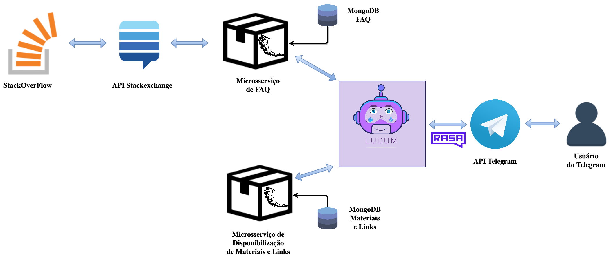

# Histórico de Revisão

| Data   | Versão | Modificação  | Autor  |
| :------- | :--------- | :---------------- | :------- |
| 31/03/2019 | 0.1   |  Iniciação  | Lucas Penido  |
| 01/04/2019 | 0.2   | Definição das tecnologias e padrão arquitetural  | Lucas Penido  |
| 04/04/2019 | 0.3   | Criação do documento  | MDS(Todos)  |
| 07/04/2019 | 0.4   | Modificação da parte 2 do documento | João Pedro, Wictor Girardi, João de Assis e Lucas Ganda |
| 11/04/2019 | 0.5   | Modificação sessão Introdução | Thallys |
| 12/04/2019 | 0.6   | Correção de estrutura e escrita| Thallys |
| 21/04/2019 | 0.7   | Adicionando diagrama de relações | Gabriela de Moraes, Guilherme Siqueira, Lucas Lermen, Lucas Penido |
| 30/04/2019 | 0.8 | Refatorando Documento | Gabriela de Moraes, Lucas Lermen, Lucas Penido |
| 30/04/2019 | 0.9 | Adicionando Diagrama de funcionamento do Rasa | Thallys |

# 1. Introdução  

## 1.1 Finalidade  

&emsp;&emsp;Este documento visa apresentar a arquitetura de software aplicada no desenvolvimento do ChatBot Ludum, garantindo uma facilidade na visualização dos requisitos e da estrutura para com os desenvolvedores. Ao esboçar uma visão ampla da arquitetura do ChatBot, é possível evidenciar seus aspectos do sistema em diversas técnicas.

## 1.2 Escopo

&emsp;&emsp;O Ludum busca auxiliar pessoas que desejam aprender a desenvolver jogos em Python, por meio de fluxos de conversas e com auxilio de microsserviços para o realização de funcionalidades externas ao núcleo do Ludum. Este chatbot auxiliará na configuração do ambiente, no desenvolvimento de jogos com tutoriais e busca de dúvidas em ferramenta externa. 

## 1.3 Definições, Acrônimos e Abreviações

<html>
<ul>
<li> FAQ: <i>Frequently Asked Questions</i></li>
<li> MDS: Método de Desenvolvimento de Software</li>
<li> API: <i>Application Programming Interface </i></li>
<li> DB: Banco de Dados, <i>DataBase</i> </li>

</ul>
</html>

## 1.4 Visão Geral

&emsp;&emsp;Documento cujo objetivo, por meio de tópicos, é detalhar os requisitos e a arquitetura do ChatBot Ludum, visando de esclarecer dúvidas, facilitar o desenvolvimento e o entendimento de suas funções.

Estrutura do documento:  

<html>
<ul>

<li> Introdução; </li>
<li> Representação da Arquitetura; </li>
<li> Metas e Restrições de Arquitetura; </li>
<li> Visão lógica;   </li>
<li> Visão de Implantação </li>
<li> Visão de Implementação </li>
<li> Visão Geral </li>
<li> Camadas </li>
<li> Visão de Dados </li>       
<li> Tamanho e Desempenho </li>

</ul>
</html>

## 1.5 Referências

> MELO, Thalisson; ALVES, Álax; MARTINS, Lucas; RICHARD, Matheus; BERNARDO, Matheus de Sousa; Joranhezon. <b>Owla:</b> Documento de Arquitetura. Disponível em: <https://github.com/fga-gpp-mds/2016.2-Owla/wiki/Documento-de-Arquitetura>.

> André; Gabriel; Guilherme; ALMEIDA; Weyler. <b>Cidade Democrática:</b> Documento de Arquitetura. Disponível em: <https://github.com/fga-gpp-mds/2016.2-CidadeDemocratica/wiki/Documento-de-Arquitetura>.

> RODRIGUES, Pedro; BLANCO, Matheus; BRAGA, Gabriel; FILIPE, Gabriel; AUGUSTO, Guilherme; DE SOUZA, Letícia. <b>Lino:</b> Documento de Arquitetura. Disponível em:
<https://github.com/fga-eps-mds/2018.2-Lino/blob/master/docs/documento-de-arquitetura.md>.

# 2. Representação da Arquitetura

## 2.1 Diagrama de Relações

&emsp;&emsp;O Ludum utiliza como principal padrão arquitetural microsserviços que realizam conexões bidirecionais com o núcleo do chatbot. Cada um destes microsserviços funciona independente das demais partes do sistema.

&emsp;&emsp;Em uma visão geral, os serviços foram definidos como internos ou externos.

### 2.1.1 Externos
<html>
<ul>
<li> Aplicativo Telegram para interação </li>
<li> API StackExchange para conectar com o StackOverflow</li>
<li> API do Gmail</li>
</ul>
</html>

### 2.1.2 Internos

<html>
<ul>
<li>  Disponibilizar materiais, links e tutoriais </li>
<li>  Pesquisar Dúvidas </li>
<li>  Notificações via email sobre novos materiais, links e tutoriais </li>
</ul>
</html>

&emsp;&emsp;O microsserviço de Disponibilização de Materiais, Links e Tutoriais, retorna os mesmos ao usuário quando solicitado por ele. Os materiais e links podem ser inseridos no banco de dados pelos desenvolvedores ou contribuições da comunidade através de um WebClient. Já os tutoriais são divididos em níveis de dificuldade (fácil, médio e difícil) ou em tutoriais da comunidade submetidos ao banco pelo mesmo WebClient.

&emsp;&emsp;O microsserviço de Pesquisar de Dúvidas funciona da seguinte maneira: Quando o usuário solicita este serviço lhe é apresentada uma série de perguntas e respostas, as quais foram cadastradas pelos desenvolvedores da aplicação. Caso a dúvida feita pelo usuário não for encontrada na lista de perguntas, o usuário tem a opção de digitá-la para que seja buscada no site do StackOverflow por meio da API do StackExchange. Após a pesquisa ser realizada, os cinco primeiros resultados serão apresentados para o usuário e salvos no banco de dados do microsserviço.

&emsp;&emsp;Já o microsserviço de Notificações via email enviará uma notificação aos usuários que tiverem seu email cadastrado no banco de dados do Núcleo da aplicação, cada vez que um material, link ou tutorial for cadastrado.

## 2.2 Tecnologias

### 2.2.1 API Telegram Messenger

&emsp;&emsp;<i>Telegram Messenger</i> é um aplicativo de comunicação baseado em nuvem. O qual oferece a possibilidade para seus usuários desenvolvedores criarem <i>bots</i> a partir de sua API.

&emsp;&emsp;Essa <i>API</i> será a ponte de comunicação com o usuário. O código fonte será implementado e o Ludum irá interagir com o usuário de acordo com o que foi definido neste código fonte.

### 2.2.2 MongoDB

&emsp;&emsp;O MongoDB é um banco de dados NoSQL, <i>open-source</i>, sem esquemas e orientado à documentos JSON.

&emsp;&emsp;Esta tecnologia será utilizada para criação de banco de dados que se conectarão aos microsserviços de Pesquisar Dúvida e de Materiais e Links, além do Núcleo do ChatBot. Cada um destes elementos terá um banco de dados próprios.

### 2.2.3 Rasa

&emsp;&emsp;O Rasa é um conjunto de ferramentas <i>open-sources</i> de <i>Machine Learning</i> para os desenvolvedores criarem chatbots e assistentes contextuais baseados em texto e voz. 

### 2.2.4 Rasa Core

&emsp;&emsp;Um framework de chatbot com gerenciamento de diálogo baseado em <i>Machine Learning</i>.

### 2.2.5 Rasa NLU

&emsp;&emsp;Uma biblioteca para compreensão de linguagem natural com intenção de classificação e extração de entidade. 

### 2.2.6 Stack Exchange API

&emsp;&emsp;API utilizada para conexão com o StackOverflow, onde será realizado buscas de dúvidas pertinentes ao usuário. 

# 3. Metas e Restrições de Arquitetura

&emsp;&emsp;As restrições de arquitetura do projeto são:

<html>
<ul>

<li> Utilização de um Banco de Dados <i>MongoDB</i> de versão 4.0.8 para cada serviço interno e para ser utilizado a partir do Python será utilizado PyMongo na versão 3.7.2  </li>
<li> Utilização da ferramenta Docker para a virtualização dos ambientes de forma prática e adequada </i>
<li> Conexão com a internet necessária. </li>

</ul>
</html>

&emsp;&emsp;As metas do projeto são:

<html>
<ul>

<li> Disponibilizar um fluxo de conversa com o usuário a fim de atender/suprir as dúvidas em relação à procedimentos voltados ao desenvolvimento de jogos em Python. </li>
<li> Fornecer aos usuários links e dicas de como configurar seu ambiente. </li>
<li>O Ludum deverá ensinar ao usuário a criar jogos em diferentes níveis de dificuldades. </li>

</ul>
</html>

# 4. Visão Lógica

## 4.1 Visão Lógica Geral

&emsp;&emsp;Esta seção descreve as partes significativas do ponto de vista da arquitetura do modelo de design. Além disso, para cada pacote significativo, descreve suas responsabilidades, bem como algumas operações e atributos de grande importância.

## 4.2 Diagrama de Pacotes

    Neste tópico se encontram a descrição de alguns pacotes utilizados bem como suas explicações e utilidades.

<html>
<ul>

<li> O pacote <i>2019.1-Ludum</i> é o pacote principal do projeto e conterá todos os outros sub-pacotes e documentos existentes no projeto. </li>
<li> No pacote <i>docs</i>, serão apresentados os documentos necessários para a compreensão do projeto, bem como pacote <i>policies</i>. </li>
<li> No pacote <i>Policies</i> estão contidas as políticas de boas práticas de programação e uso da plataforma <i>GitHub</i>. </li>

</ul>
</html>

 

## 4.4 Modelagem do Banco de Dados do Microsserviço De Resolução de Dúvidas

# 5. Visão de Implantação
# 6. Visão de Implementação
## 6.1 Visão Geral
## 6.2 Camadas
# 7. Visão de Dados       
# 8. Tamanho e Desempenho
