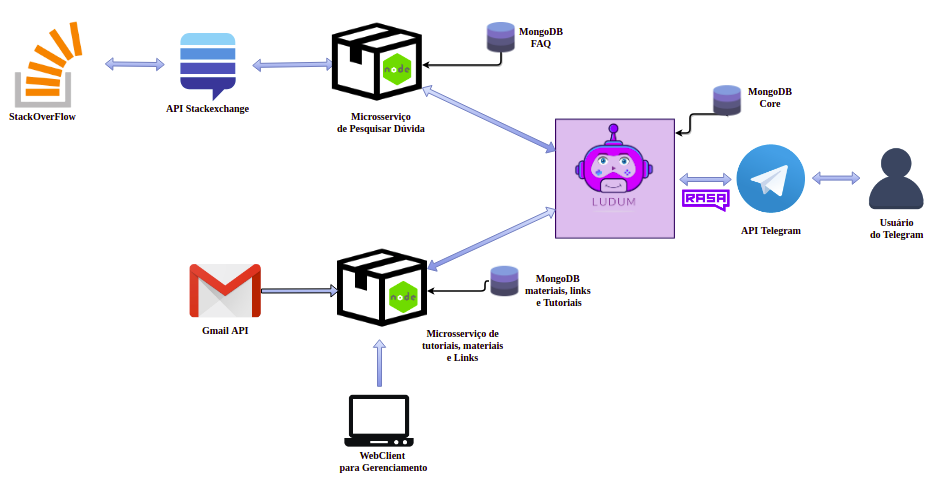
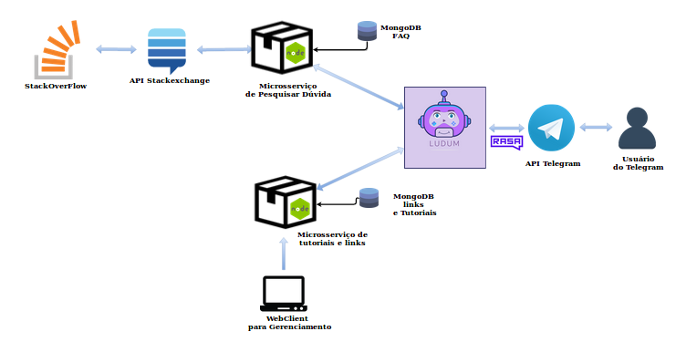
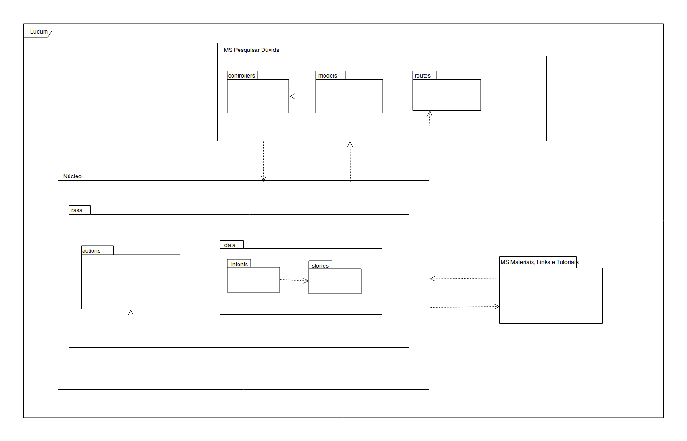
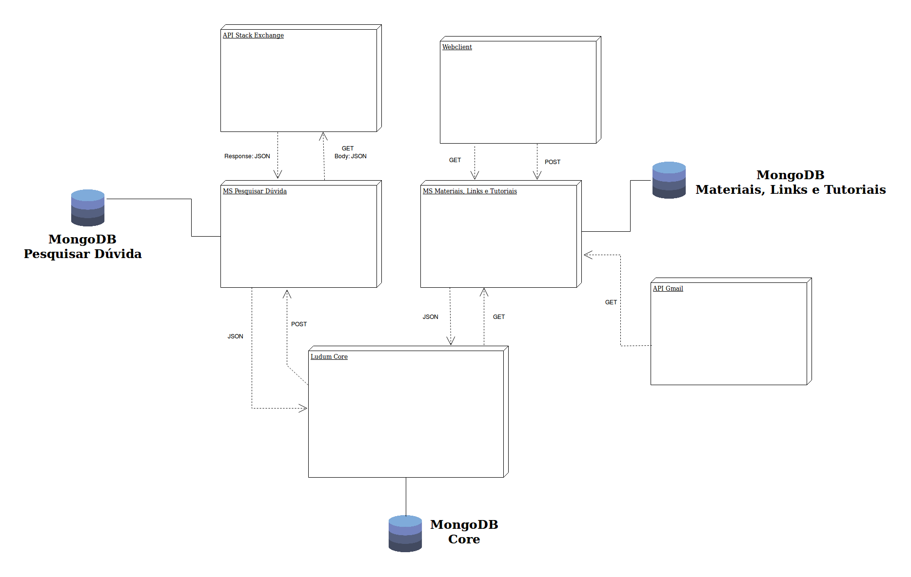
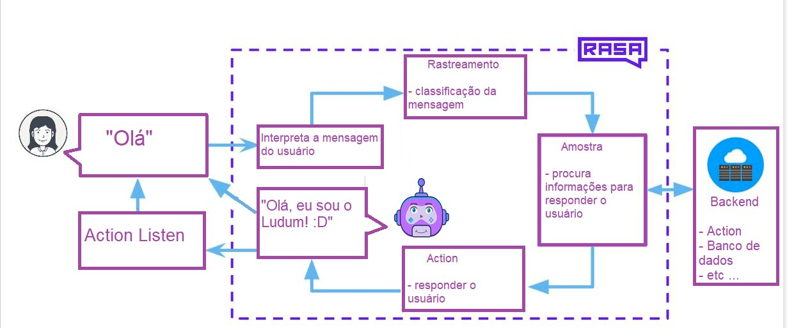
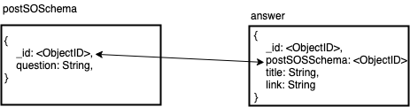

# Histórico de Revisão

| Data   | Versão | Modificação  | Autor  |
| :------- | :--------- | :---------------- | :------- |
| 31/03/2019 | 0.1   |  Iniciação  | Lucas Penido  |
| 01/04/2019 | 0.2   | Definição das tecnologias e padrão arquitetural  | Lucas Penido  |
| 04/04/2019 | 0.3   | Criação do documento  | MDS(Todos)  |
| 07/04/2019 | 0.4   | Modificação da parte 2 do documento | João Pedro, Wictor Girardi, João de Assis e Lucas Ganda |
| 11/04/2019 | 0.5   | Modificação sessão Introdução | Thallys |
| 12/04/2019 | 0.6   | Correção de estrutura e escrita| Thallys |
| 21/04/2019 | 0.7   | Adicionando diagrama de relações | Gabriela de Moraes, Guilherme Siqueira, Lucas Lermen e Lucas Penido |
| 30/04/2019 | 0.8 | Refatorando seções 1 e 2 | Gabriela de Moraes, Lucas Lermen e Lucas Penido |
| 30/04/2019 | 0.9 | Adicionando Diagrama de funcionamento do Rasa | Thallys |
| 31/04/2019 | 1.0 | Refatorando seções 3, 4, 6, 7, 8 | Gabriela de Moraes e Lucas Lermen |
| 31/04/2019 | 1.1 | Refatorando diagramas | Gabriela de Moraes, Lucas Lermen, Lucas Penido e Guilherme Siqueira |
| 13/05/2019 | 1.2 | Adicionando diagrama de relações do projeto| Gabriela, Lucas Lermen e Guilherme |

# 1. Introdução  

## 1.1 Finalidade  

Este documento visa apresentar a arquitetura de software aplicada no desenvolvimento do ChatBot Ludum, garantindo uma facilidade na visualização dos requisitos e da estrutura para com os desenvolvedores. Ao esboçar uma visão ampla da arquitetura do ChatBot, é possível evidenciar seus aspectos do sistema em diversas técnicas.

## 1.2 Escopo

O Ludum busca auxiliar pessoas que desejam aprender a desenvolver jogos em Python, por meio de fluxos de conversas e com auxilio de microsserviços para o realização de funcionalidades externas ao núcleo do Ludum. Este chatbot auxiliará na configuração do ambiente, no desenvolvimento de jogos com tutoriais e busca de dúvidas em ferramenta externa. 

## 1.3 Definições, Acrônimos e Abreviações

<html>
<ul>
<li> FAQ: <i>Frequently Asked Questions</i></li>
<li> MDS: Método de Desenvolvimento de Software</li>
<li> API: <i>Application Programming Interface </i></li>
<li> DB ou BD: Banco de Dados, <i>DataBase</i> </li>
<li> MS: Microsserviço </li>
<li> MLT: Materiais, Links e Tutoriais </li>

</ul>
</html>

## 1.4 Visão Geral

Documento cujo objetivo, por meio de tópicos, é detalhar os requisitos e a arquitetura do ChatBot Ludum, visando de esclarecer dúvidas, facilitar o desenvolvimento e o entendimento de suas funções.

Estrutura do documento:  

<html>
<ul>

<li> Introdução; </li>
<li> Representação da Arquitetura; </li>
<li> Metas e Restrições de Arquitetura; </li>
<li> Visão lógica;   </li>
<li> Visão de Implantação </li>
<li> Visão de Implementação </li>
<li> Visão Geral </li>
<li> Camadas </li>
<li> Visão de Dados </li>       
<li> Tamanho e Desempenho </li>

</ul>
</html>

## 1.5 Referências

> MELO, Thalisson; ALVES, Álax; MARTINS, Lucas; RICHARD, Matheus; BERNARDO, Matheus de Sousa; Joranhezon. <b>Owla:</b> Documento de Arquitetura. Disponível em: <https://github.com/fga-gpp-mds/2016.2-Owla/wiki/Documento-de-Arquitetura>.

> André; Gabriel; Guilherme; ALMEIDA; Weyler. <b>Cidade Democrática:</b> Documento de Arquitetura. Disponível em: <https://github.com/fga-gpp-mds/2016.2-CidadeDemocratica/wiki/Documento-de-Arquitetura>.

> RODRIGUES, Pedro; BLANCO, Matheus; BRAGA, Gabriel; FILIPE, Gabriel; AUGUSTO, Guilherme; DE SOUZA, Letícia. <b>Lino:</b> Documento de Arquitetura. Disponível em:
<https://github.com/fga-eps-mds/2018.2-Lino/blob/master/docs/documento-de-arquitetura.md>.

>JUNIOR, Luiz Fernando Duarte. MongoDB para iniciantes em NoSQL. [S. l.], 28 set. 2017. Disponível em: https://imasters.com.br/banco-de-dados/mongodb-para-iniciantes-em-nosql. Acesso em: 30 abr. 2019.

# 2. Representação da Arquitetura

## 2.1 Diagrama de Relações

## Produto

## Projeto 

O Ludum utiliza como principal padrão arquitetural microsserviços que realizam conexões bidirecionais com o núcleo do chatbot. Cada um destes microsserviços funciona independente das demais partes do sistema.

Em uma visão geral, os serviços foram definidos como internos ou externos.

### 2.1.1 Externos
<html>
<ul>
<li> Aplicativo Telegram para interação </li>
<li> API StackExchange para conectar com o StackOverflow</li>
<li> API do Gmail</li>
</ul>
</html>

### 2.1.2 Internos

<html>
<ul>

<li>  Disponibilizar materiais, links e tutoriais </li>
<li>  Pesquisar Dúvidas </li>

</ul>
</html>

O microsserviço de Disponibilização de Materiais, Links e Tutoriais, retorna os mesmos ao usuário quando solicitado por ele. Os materiais e links podem ser inseridos no banco de dados pelos desenvolvedores ou contribuições da comunidade através de um WebClient. Já os tutoriais são divididos em níveis de dificuldade (fácil, médio e difícil) ou em tutoriais da comunidade submetidos ao banco pelo mesmo WebClient. Além disso, será enviada uma notificação via e-mail aos usuários que tiverem seu e-mail cadastrado no banco de dados do Núcleo da aplicação, cada vez que um material, link ou tutorial for cadastrado.

O microsserviço de Pesquisar de Dúvidas funciona da seguinte maneira: Quando o usuário solicita este serviço lhe é apresentada uma série de perguntas e respostas, as quais foram cadastradas pelos desenvolvedores da aplicação. Caso a dúvida feita pelo usuário não for encontrada na lista de perguntas, o usuário tem a opção de digitá-la para que seja buscada no site do StackOverflow por meio da API do StackExchange. Após a pesquisa ser realizada, os cinco primeiros resultados serão apresentados para o usuário e salvos no banco de dados do microsserviço.

## 2.2 Tecnologias

### 2.2.1 API Telegram Messenger

<i>Telegram Messenger</i> é um aplicativo de comunicação baseado em nuvem. O qual oferece a possibilidade para seus usuários desenvolvedores criarem <i>bots</i> a partir de sua API.

Essa <i>API</i> será a ponte de comunicação com o usuário. O código fonte será implementado e o Ludum irá interagir com o usuário de acordo com o que foi definido neste código fonte.

### 2.2.2 MongoDB

O MongoDB é um banco de dados NoSQL, <i>open-source</i>, sem esquemas e orientado à documentos JSON.

Esta tecnologia será utilizada para criação de banco de dados que se conectarão aos microsserviços de Pesquisar Dúvida e de Materiais e Links, além do Núcleo do ChatBot. Cada um destes elementos terá um banco de dados próprios.

### 2.2.3 Rasa

O Rasa é um conjunto de ferramentas <i>open-sources</i> de <i>Machine Learning</i> para os desenvolvedores criarem chatbots e assistentes contextuais baseados em texto e voz. 

### 2.2.4 Rasa Core

Um framework de chatbot com gerenciamento de diálogo baseado em <i>Machine Learning</i>.

### 2.2.5 Rasa NLU

Uma biblioteca para compreensão de linguagem natural com intenção de classificação e extração de entidade. 

### 2.2.6 Stack Exchange API

API utilizada para conexão com o StackOverflow, onde será realizado buscas de dúvidas pertinentes ao usuário. 

# 3. Metas e Restrições de Arquitetura

As restrições de arquitetura do projeto são:

<html>
<ul>

<li> O núcleo do Ludum deve ser desenvolvido em Pyhton 3.6 </i>
<li> Uso do Docker para desenvolvimento em ambientes isolados; </li>
<li> Telegram necessário para consversar com o Ludum; </i>
<li> Conexão com a internet necessária; </li>
<li>As conversas com o Ludum são feitas em português, porém o microserviço de pesquisa de dúvidas no StackOverFlow meramente retorna resultados em língua inglesa. </li>
<li> O Ludum deve ser desenvolvido em aproximadamente 4 meses; </li>

</ul>
</html>

# 4. Visão Lógica

## 4.1 Visão Geral

Como citado anteriormente, a arquitetura do Ludum é baseada no uso de microsserviços que se conectam com o núcleo da aplicação. Assim sendo, pode ser representada por meio de um diagrama de pacotes onde cada microsserviço e o núcleo são representados por esses pacotes e, por sua vez, são compostos por outros pacotes significativos para seu correto funcionamento.

## 4.2 Pacotes Significativos do Ponto de Vista da Arquitetura

# 5. Visão de Implantação

# 6. Visão de Implementação
## 6.1 Visão Geral

 Cada microsserviço funciona independente das outras partes do sistema, tópico que foi abordado na representação da arquitetura. Destarte, cada serviço da aplicação possui particulariadades arquiteturais que virão a ser destrinchadas nos tópicos a seguir.

## 6.2 Núcleo

# 7. Visão de Dados  

## 7.1 Visão geral

 Os microsserviçoes e o núcleo do Ludum possuem bancos de dados para armazenar os dados necessários para o funcionamento do serviço em questão. Nós tópicos a seguir serão apresentados os modelos de dados de cada um desses serviços

## 7.2 BD do microsserviço Perguntas

# 8. Tamanho e Desempenho

 Haja visto que o Ludum é um ChatBot para o telegram, seu tamanho tende a seguir um padrão para esses tipos de aplicação. Não obstante, o mesmo se utiliza de microsserviços que acarretam em um aumento significativo de sua robustez.

 No tocante ao desempenho, a arquitetura de microsserviços, por sua grande autonomia das partes, previne que o desempenho do sistema como um todo fique comprometido no caso de falha em um de seus serviços. Porém, o desempenho do Ludum, também é condicionado por questões que envolvem os serviços externos, como por exemplo falhas nas APIs do Gmail e do StackOverFlow, bem como problemas relacionados ao próprio Telegram.

