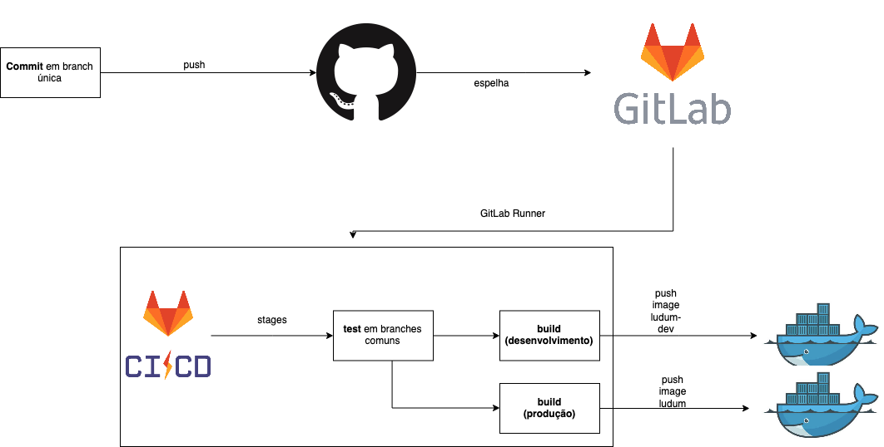

# Histórico de Versão

 **Data** | **Versão** | **Descrição** | **Autor(es)**
---|---|---|---
15/04/2019 | 0.1 | Documentado git flow até integração contínua | Guilherme Siqueira e Lucas Penido

# Introdução
O Git Flow apresentado no diagrama trabalha com dois estágios: test e build. O commit feito no GitHub é espelhado no GitLab, pois a integração contínua é um serviço GitLab (GitLab CI). A integração contínua no estágio de teste roda em qualquer branch, mas o estágio de build só roda quando entra novos commits na branch de homologação ou produção. Quando um commit entra na branch de homologação, a imagem ludum-dev no docker hub é atualizada. O mesmo acontece quando um novo commit entra na branch master, só que neste caso, a imagem que é atualizada é a ludum, que é a padrão

