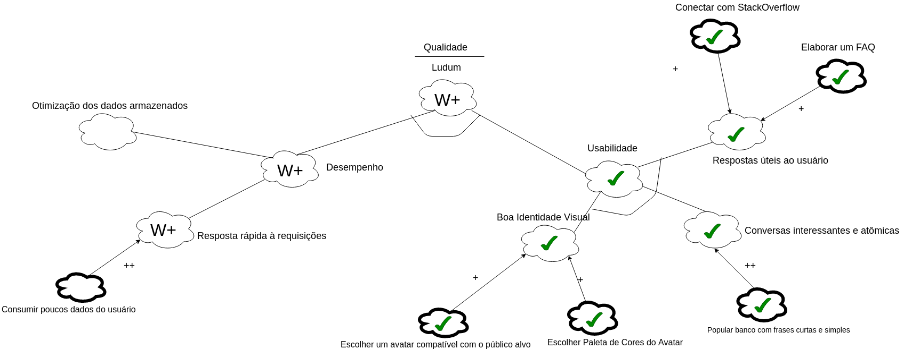

## Histórico de Revisão
Data|Descrição|Versão|Autor(es)
:--:|:--:|:--:|:--:
01/04/2019|0.1|Criação do documento| Gabriela, Guilherme e Lucas Lermen
01/04/2019|0.2|Inclusão do NFR 0.1| Gabriela, Guilherme e Lucas Lermen

___

## Sumário

1. [Introdução](#_1-introdução) 
2. [NFR's](#_2-nfrs) 
2.1 [Versão 0.1](#_21-versão-01) 
3. [Referências](#_3-referências)

## 1. Introdução

Trata-se de um framework conceitual para condução da Engenharia de Requisitos orientada aos requisitos não funcionais, com uma extensão que apoia suposições para avaliação de satisfação das metas-flexíveis.

## 2. NFRs

### 2.1. Versão 0.1

## 3. Referências
>[1] Slide da aula 17 da disciplina de Requisitos de Software da UnB-Gama - Professores: Milene Serrano e Maurício Serrano