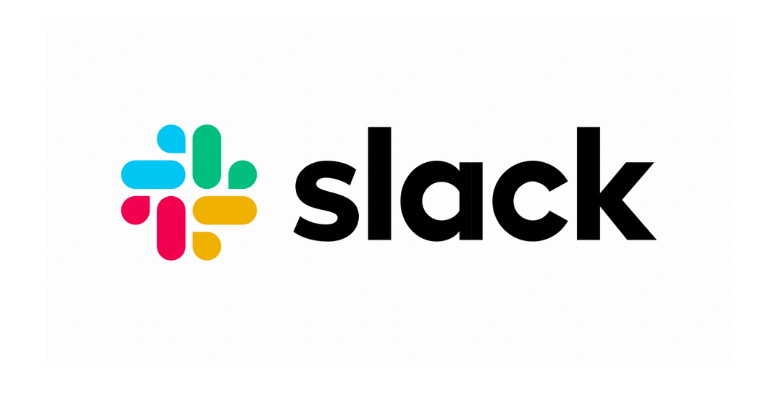

## Histórico de revisão
| Data | Versão | Descrição | Autor |
|-|-|-|-|
| 23/04/2019 | 0.1 | Criação do documento | Lucas Lermen |
| 23/04/2019 | 0.2 | Adição das ferramentas e dos rituais | Lucas Lermen e Gabriela Moraes |

## Sumário

1. [Objetivo](#_1-objetivo)
2. [Ferramentas](#_2-ferramentas)
3. [Rituais](#_3-rituais)

## 1.Objetivo

 Este documento tem como objetivo explicitar as formas de comunicação utilizadas pela equipe.

## 2.Ferramentas

### Telegram

  
    

Utilizado para assuntos gerais e conversas que não são relacionadas ao projeto.

### Slack

  
    

Utilizado para conversas sobre o projeto, realização de <i>Daily Meetings</i> e é onde está localizado o bot que controla os repositórios do projeto.

### Google drive

  
    

Utilizado para armazenar planilhas de controle e alguns artefatos do projeto.

### Github

  
    

Utilizado para o versionamento e armazenamento do código, bem como para a organização de <i>issues</i>.

### Zenhub

  
    

Utilizado para aplicação do <i>Kanban</i> e coleta de algumas métricas de produtividade por meio controle de <i>issues</i>.

### Hangouts

  
    

Utilizado para realização de reuniões não presenciais, principalmente os planejamentos e revisões de sprints.

## 3.Rituais

### Planejamento da <i>sprint</i>

Reunião semanal com duração de uma hora e trinta minutos onde são definidas as tarefas a serem realizadas durante a <i>sprint</i>. Após a definição, cada tarefa tem seu esforço necessário para realização discutido e, por meio do <i>planITpoker</i> as mesmas são pontuadas. Além disso, os pareamentos também são definidos durante essa reunião.

### Retrospectiva e revisão da <i>sprint</i>

Reunião semanal com duração de uma hora e trinta minutos onde cada pareamento apresenta o trabalho desenvolvido durante a <i>sprint</i>. Após isso, cada membro apresenta os pontos positivos, pontos negativos e sugestões de melhoria encontrados durante a <i>sprint</i>. Por fim, o <i>Tech Leader</i> escreve a sua análise sobre a semana da equipe, apresentando os acertos, os erros e as conclusões acerca do trabalho realizado.

### <i>Daily Meeting</i>

Reunião diária com duração de quinze minutos onde cada membro da equipe, comenta sobre o que ele foi capaz de realizar no presente dia, quais foram os impedimentos encontrados para a realização das atividades e o que o mesmo pretende fazer no dia subsequente à reunião.

