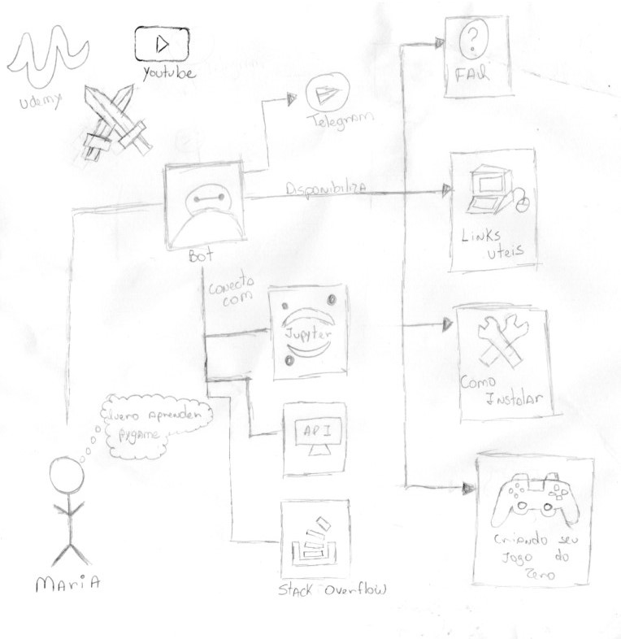

## Histórico de revisão
| Data | Versão | Descrição | Autor(es) |
|:--:|:--:|:--:|:--:|
| 26/03/2018 | 0.1 | Criação do documento| Gabriela Moraes |
| 26/03/2018 | 0.2 | Adição do Rich Picture geral| Gabriela Moraes |

## Sumário

1. [Introdução](#_1-introdução)
2. [RichPictures](#_2-richpictures)
3. [Referências](#_3-referências)

## 1. Introdução

Trata-se de uma modelagem cuja notação permite analisar problemas e expressar ideias. Pode auxiliar na identificação: de processos de negócio e seus requisitos; de atores envolvidos nos processos de negócio e suas responsabilidades; dos relacionamentos entre processos e atores, e de potenciais problemas e conflitos. [1]

## 2. RichPictures

### Geral

## 3. Referências
>[1] Slide 10 da aula 04 da disciplina de Requisitos de Software da UnB-Gama - Professores: Milene Serrano e Maurício Serrano
