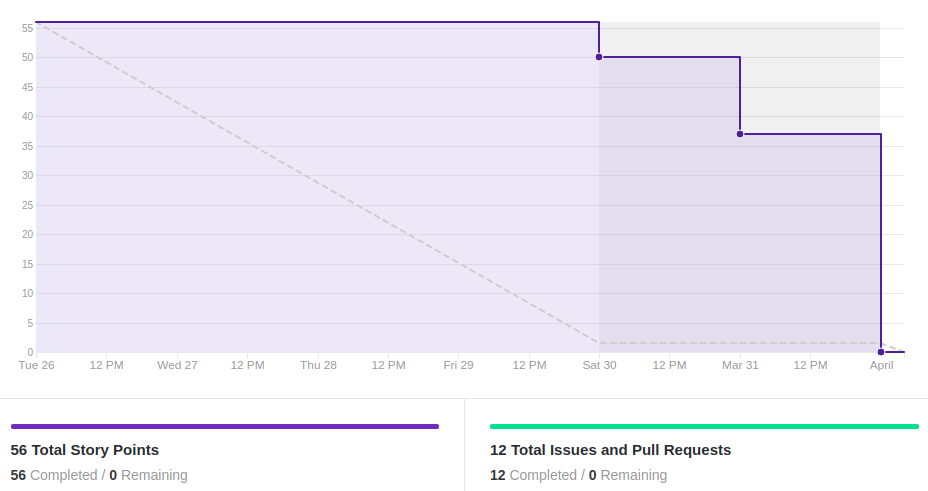
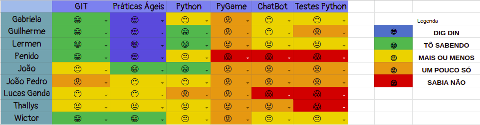
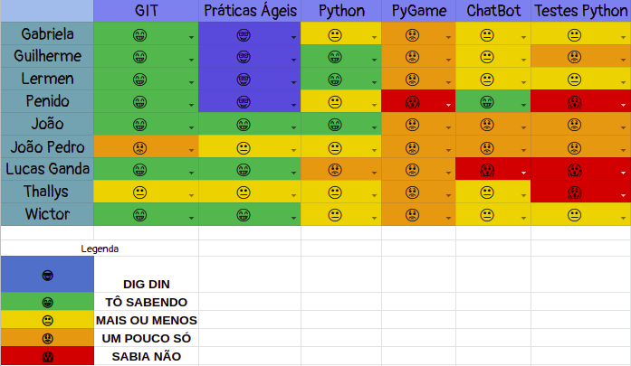

# Resultado Sprint 1

## 1. Indicadores de Qualidade do Processo

### 1.1 Fechamento da _Sprint_

**Pontos Concluídos:** 56

| Tarefas | Status |
|--|--|
| T07 | Concluída |
| T08 | Concluída |
| T09 | Concluída |
| T10 | Concluída |
| T11 | Concluída |
| T12 | Concluída |
| T13 | Concluída |
| T14 | Concluída |
| T15 | Concluída |
| T16 | Concluída |
| T17 | Concluída |

### 1.2 _Burndown_

### 1.3 _Velocity_

### 1.4 Retrospectiva

|Membro|Pontos Positivos|Pontos Negativos|Sugestões de melhoria| Pontuação das histórias |
|---|------|-----|---|---|
|Gabriela Moraes|Documentos de alta relevância para o projeto foram concluídos | Excesso de tarefas | -| A pontuação da EAP poderia ter sido maior, NFR e Backlog demandaram menos do que o pontuado
|Guilherme Siqueira|Conhecimento de docker adquirido |Demora na escolha das tecnologias | - |EAP precisou de mais esforço que o pontuado|
|Lucas Lermen| Diversos documentos importantes do projeto foram concluídas | Excesso de tarefas | - | Backlog e NFR foram muito pontuados e EAP pouco pontuada |
|Lucas Penido| Avanço na arquitetura e tecnologias do projeto | Pouco tempo para realizar as tarefas | Não ter vida social | Alguns documentos foram pontuados de forma errada |
|João de Assis|Conhecimento adquirido em Python |Atrasos devido a viagem | |Achei correta|
|João Pedro| Adquiri conhecimento em Python| Muitas tarefas| | Correta|
|Lucas Ganda|Conhecimento de documentação adquirido | - - | - - | Correta |
|Thallys Braz|Conhecimento adquirido em chat bot | Pouco tempo pra treinar os novos conhecimentos | ---| Achei justa
|Wictor Girardi|Comunicação e responsabilidade do grupo em executar as tarefas |-- |Se possivel fechar as tarefas um pouco antes| Justa

### 1.5 Quadro de Conhecimento

##### Quadro de conhecimento inicial

##### Quadro de conhecimento final

## 2. Análise do _Tech Leader_

A presente <i>sprint</i> era de extremo risco devido à sua alta pontuação(56 pontos) e à elaboração de documentos chave para o projeto.

Durante a <i>sprint</i>, reuniões diárias ocorreram via <i>Slack</i>, contando com a presença de praticamente todos os membros das equipes na maior parte delas. Essas reuniões serviram para evidenciar o cumprimento das funções delegadas. Serviram também para organizar a equipe, já que um dos membros ficou incapacitado a maior parte da semana devido em decorrência de um problema de saúde.

O <i>Burndown</i> da <i>sprint</i> evidenciou que as entregas foram realizadas nos últimos dias, o que ocorreu por causa do grande número de tarefas programadas.

O quadro de conhecimento demonstra que houveram melhoras no aspecto relacionado ao Git às práticas ágeis. Esses dois pontos foram os mais abordados nessa <i>sprint</i>.

Apesar dos empecilhos, todas as tarefas planejadas foram entregues, evidenciando um grande esforço e comprometimento da equipe.

