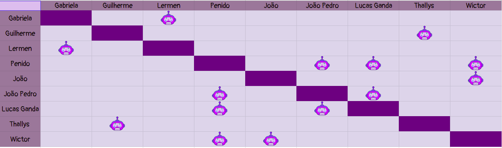

# Planejamento Sprint 10

**Data de Início**: 04/06/2019

**Data de Término**: 10/06/2019

**Duração**: Uma semana

**Pontos Planejados**: 59

-------

[1. Papéis](#_1-papéis)

[2. Planejamento das tarefas](#_2-planejamento-das-tarefas)

[3. Tarefas da _Sprint_](#_3-tarefas-da-sprint)  

  * [3.1. Planejadas](#_31-planejadas)

-------

## 1. Papéis

**Tech Leader**: Lucas Lermen

**Product Manager**: Gabriela Moraes

**DevOps**: Guilherme Siqueira

**Arquiteto de Software**: Lucas Penido

## 2. Planejamento das tarefas

 Para a presente <i>sprint</i> foram planejados 62 pontos bem divididos entre a equipe com o propósito de realizar um bom andamento sem sobrecarregar nehum me

## 3. Tarefas da _Sprint_

### 3.1. Planejadas

|Tarefas|Pontos|
|-|:--:|
| **Dívida** T49 - Configurar Deploy Contínuo | 13 |
| **Dívida** US15 - Aprender a criar um jogo de maior complexidade | 5 |
| T51 - Corrigir backlog e roadmap | 3 |
| T52 - Construir EVM | 5 |
| Criar modelo do teste de usabilidade | 3 |
| TS16 - Criar perfis de usuário do Webclient| 8 |
| TS20 - Criar serviço de autenticação no microsserviço de Materiais | 8 |
| US25 - Criar tela de login no Webclient | 2 |
| US17 - Eu, como usuário, desejo cadastrar um tutorial | 8 |
| US19 Eu, como administrador, desejo gerenciar o envio de tutoriais | 8 | 
| T54 - Documentar sprint | 1 |

## 4. Quadro de pareamento

