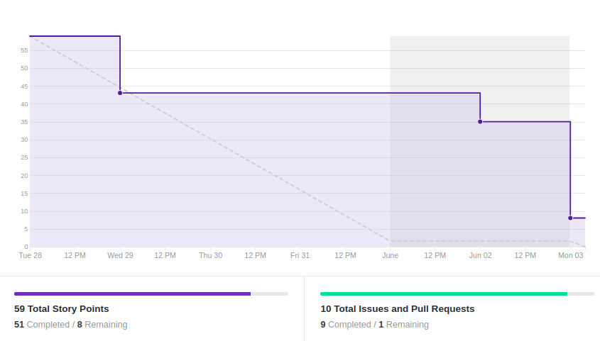
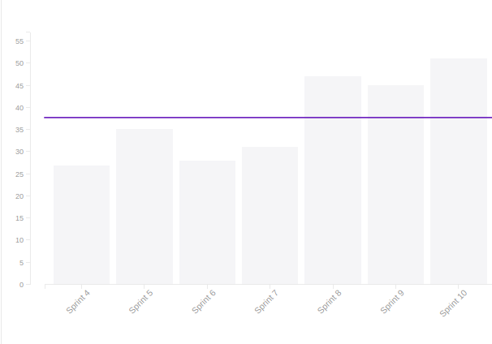
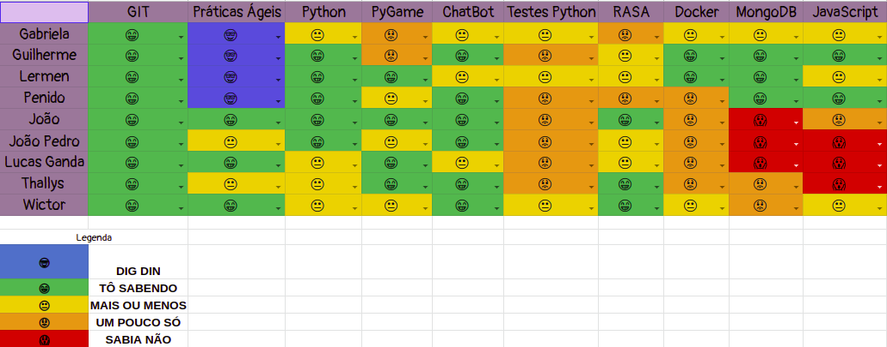

# Resultado Sprint 10

## 1. Indicadores de Qualidade do Processo

### 1.1 Fechamento da _Sprint_

**Pontos Concluídos:** 51

Tarefas | Status
|--|--|
|  |  |
|  |  |
|  |  |
|  |  |
|  |  |
|  |  |
|  |  |
|  |  |
|  |  |
|  |  |

### 1.2 _Burndown_

### 1.3 _Velocity_

### 1.4 Retrospectiva

|Membro|Pontos Positivos|Pontos Negativos|Sugestões de melhoria| Pontuação das histórias |
|---|------|-----|---|---|
|Gabriela Moraes|A EVM foi feita e houve aumento no conhecimento em relação a API| Entregas de outras matérias durante a sprint | Nenhuma | Adequada 
|Guilherme Siqueira| Deploy contínuo | - | MDS's com pouco commit serem piloto nesta sprint| Adequada
|Lucas Lermen| Webclient progredindo bem | Falta de tempo durante a sprint  | - | Adequada |
|Lucas Penido|Conhecimento com React | Dificuldade com o React | - |React foi mais difícil do que parecia|
|João de Assis|Conhecimento com React |Dependi muito do meu pareamento | | Adequada
|João Pedro|Conhecimento com React|Nunca tinha mexido com React antes e tive dificuldades|---| Adequada|
|Lucas Ganda| Mexer com react | Conhecimento insuficiente de react| -- | Adequada |
|Thallys Braz|Aumento do conhecimento em Mongo e Node|Nunca ter usado Node|--|Adequada
|Wictor Girardi| Conhecimento com React |Problemas com React e outras materias | --- |Adequada

### 1.5 Quadro de Conhecimento

##### Quadro de conhecimento inicial

##### Quadro de conhecimento final

## 2. Análise do _Tech Leader_

A <i>sprint</i> foi focada no andamento do Web Client e progrediu bem. Com exceção de uma história, todas foram entregues.

Como citado, problemas de comunicação já não existem mais entre a equipe e os membros sempre estão cientes do andamento das outras partes do projeto. Um fator de preocupação para essa <i>sprint</i> era a introdução de uma nova tecnologia, porém devido à experiência de alguns membros com essa tecnologia a equipe conseguiu se virar bem. 

O deploy contínuo que era um ponto de preocuáção foi finalizado e ajudou a equipe a tomar um bom norte sobre o projeto. Assim sendo, o projeto está bem encaminhado.

