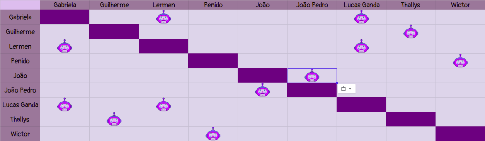

# Planejamento Sprint 11

**Data de Início**: 04/06/2019

**Data de Término**: 10/06/2019

**Duração**: Uma semana

**Pontos Planejados**: 57

-------

[1. Papéis](#_1-papéis)

[2. Planejamento das tarefas](#_2-planejamento-das-tarefas)

[3. Tarefas da _Sprint_](#_3-tarefas-da-sprint)  

  * [3.1. Planejadas](#_31-planejadas)

-------

## 1. Papéis

**Tech Leader**: Lucas Lermen

**Product Manager**: Gabriela Moraes

**DevOps**: Guilherme Siqueira

**Arquiteto de Software**: Lucas Penido

## 2. Planejamento das tarefas

 A presente <i>sprint</i> possui como foco a continuidade do Web Client em ReactJS. Assim sendo, a maior parte das tarefas estão relacionadas com o mesmo

 O principal risco para a <i>sprint</i> está relacionado ao fim do semestre acadêmico e consequentemente no maior número de tarefas conflitantes. Além disso, o notebook de um dos membros está apresentando problema e, por esse motivo, o andamento da US09 e da TS21 pode ser prejudicado

## 3. Tarefas da _Sprint_

### 3.1. Planejadas

|Tarefas|Pontos|
|-|:--:|
| **Dívida** US19 Eu, como administrador, desejo gerenciar o envio de tutoriais | 8 |
| T55 - Migrar deploy do microsserviço de dúvidas para o rancher | 5 |
| T56 - Migrar deploy do microsserviço de materiais para o rancher | 5 |
| T57 Configurar deploy contínuo da aplicação ReactJS | 5 |
| TS21 - Eu, como desenvolvedor, desejo realizar a comununicação da tela de login com o serviço de autenticação de usuário. | 5 |
| US18 - Eu, como usuário, desejo cadastrar um link | 5 |
| TS22 - Eu, como desenvolvedor, desejo realizar a comunicação da tela de cadastro de tutoriais com o respectivo endpoint. | 5 |
| TS23 - Eu, como desenvolvedor, desejo realizar a comununicação da tela de cadastro de links com o respectivo endpoint.| 5 |
| US09 - Eu, como administrador, desejo gerenciar o envio de links| 3 |
| TS24 - Eu, como desenvolvedor, desejo realizar a comununicação da tela de gerenciamento de envio de links com o respectivo endpoint. | 5 |
| TS25 - Eu, como desenvolvedor, desejo realizar a comunicação da tela de gerenciamento de envio de tutoriais com o respectivo endpoint. | 5 |
| T58 - Documentar sprint | 1 |
| T59 - Aplicar teste de usabilidade | 3 |

## 4. Quadro de pareamento

