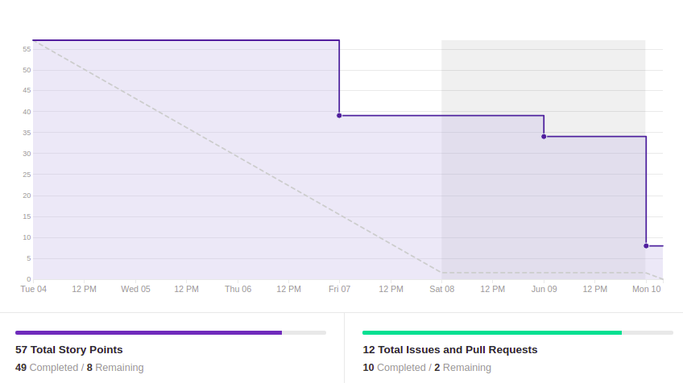
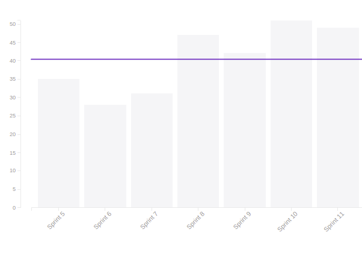

# Resultado Sprint 9

## 1. Indicadores de Qualidade do Processo

### 1.1 Fechamento da _Sprint_

**Pontos Concluídos:** 48

Tarefas | Status
|--|--|
| T55 | Concluída |
| T56 | Concluída |
| T57 | Concluída |
| T58 | Concluída |
| T59 | Não concluída |
| TS21 | Concluída |
| TS22 | Concluída |
| TS23 | Concluída |
| TS24 | Não concluída |
| TS25 | Concluída |
| US09 | Concluída |
| US18 | Concluída |
| US19 | Concluída |

### 1.2 _Burndown_

### 1.3 _Velocity_

### 1.4 Retrospectiva

|Membro|Pontos Positivos|Pontos Negativos|Sugestões de melhoria| Pontuação das histórias |
|---|------|-----|---|---|
|Gabriela Moraes| Aumento do conhecimento em react | Minha máquina apresentou defeito durante a Sprint o que prejudicou o cumprimento da TS24 e dívida no teste de usabilidade |-|Adequada 
|Guilherme Siqueira|Aplicação reactjs bem avançada, com bastante coisa já pronta.  | - |  - |Ok.
|Lucas Lermen| Web Client está praticamente pronto | Pareamento nessa sprint foi atrapalhado por falha no equipamento | - | Adequada |
|Lucas Penido|Web Client melhor que o bot | - | - | Adequada|
|João de Assis| Novos conheceimentos com React|Falha no equipamento dificultou o desenvolvimento | |Adequada
|João Pedro|Novos conhecimentos com React|Nunca ter mexido com React antes deixou tudo mais dificil e demorado|---|Adequada|
|Lucas Ganda| Conhecimento em react | Problemas no pareamento | -- | Adequada  |
|Thallys Braz|Organização do front-end|Bugs do npm no meu not|--|Adequada
|Wictor Girardi|Conhecimento melhorado com o React e endpoints| Algumas dificudades com o react| ——| Adequada 

### 1.5 Quadro de Conhecimento

##### Quadro de conhecimento inicial

##### Quadro de conhecimento final

## 2. Análise do _Tech Leader_