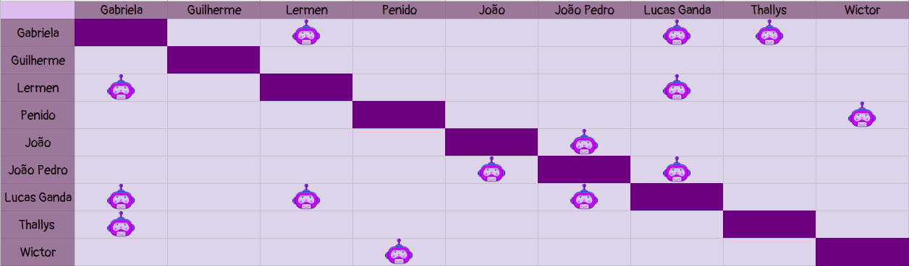

# Planejamento Sprint 12

**Data de Início**: 12/06/2019

**Data de Término**: 17/06/2019

**Duração**: Uma semana

**Pontos Planejados**: 32

-------

[1. Papéis](#_1-papéis)

[2. Planejamento das tarefas](#_2-planejamento-das-tarefas)

[3. Tarefas da _Sprint_](#_3-tarefas-da-sprint)  

  * [3.1. Planejadas](#_31-planejadas)

[4. Pareamentos](#_4-pareamentos_) 

-------

## 1. Papéis

**Tech Leader**: Lucas Lermen

**Product Manager**: Gabriela Moraes

**DevOps**: Guilherme Siqueira

**Arquiteto de Software**: Lucas Penido

## 2. Planejamento das tarefas

 A quantidade de pontos das tarefas planejadas diminuiu, tendo em vista que está se aproximando o final do projeto. Assim sendo, essa e a próxima sprint estão servindo para a realização dos ajustes finais do produto a ser entregue. 

## 3. Tarefas da _Sprint_

### 3.1. Planejadas

|Tarefas|Pontos|
|-|:--:|
| **Dívida** TS24 - Conectar tela de gerenciamento de links à API | 5 |
| **Dívida** T59 - Aplicar teste de usabilidade | 3 |
| TS04 - Popular banco de dados com links | 3 |
| US20 - Visualizar tutoriais da comunidade | 5 |
| US22 - Acessar tutorial da comunidade | 8 | 
| US10 - Recomendar Materiais | 5 |
| US08 - Informar sobre formas de contribuição com conteúdo| 2 |
| T60 - Documentar sprint | 1 |

## 4. Quadro de pareamento

