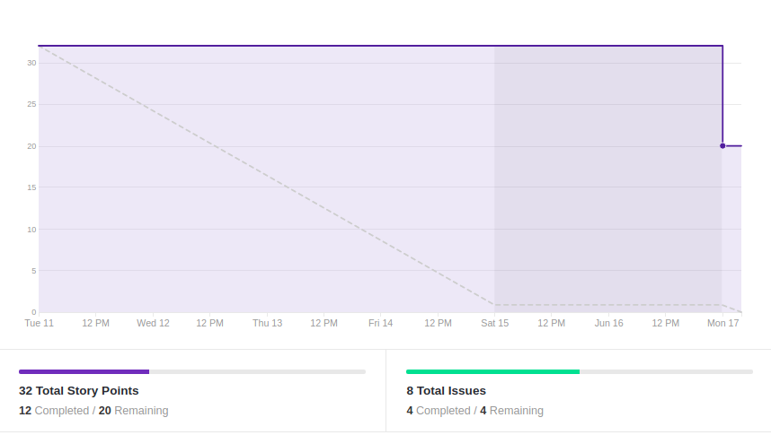
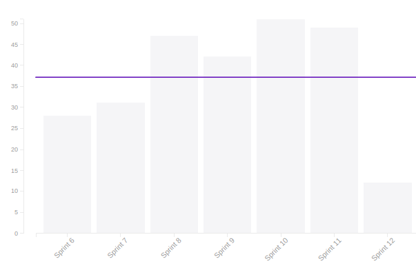
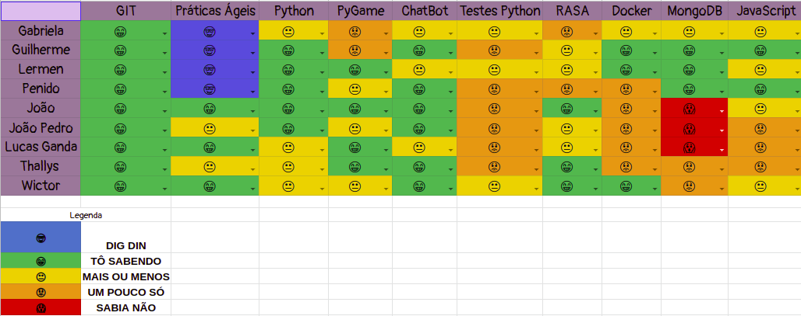
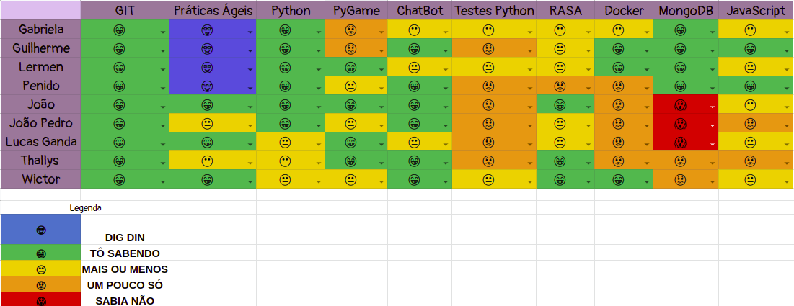

# Resultado Sprint 9

## 1. Indicadores de Qualidade do Processo

### 1.1 Fechamento da _Sprint_

**Pontos Concluídos:** 12

Tarefas | Status
|--|--|
| TS24 | Concluída |
| TS04 | Concluída |
| US20 | Não Concluída |
| US22 | Não Concluída | 
| US10 | Não Concluída |
| US08 | Não Concluída |
| T59 | Concluída |
| T60 | Concluída |

### 1.2 _Burndown_

### 1.3 _Velocity_

### 1.4 Retrospectiva

|Membro|Pontos Positivos|Pontos Negativos|Sugestões de melhoria| Pontuação das histórias |
|---|------|-----|---|---|
|Gabriela Moraes| Aumento no conhecimento em relação ao bot e o rasa, dívida foi feita | Prova durante a sprint, limitação da minha máquina para rodar o bot e dificuldade para atualizar a tela de gerência de links | - | Adequada
|Guilherme Siqueira| | | |
|Lucas Lermen| Dívida concluída e projeto encaminhado | Alguns problemas encontrados no bot | - | Adequada |
|Lucas Penido| Melhora no bot | Semana de prova | - | Adequada |
|João de Assis|Resolvemos o problema do docker |O bot quebrou|Não subam a pasta models |Justa
|João Pedro|Melhorias no bot e conhecimento com rasa|Nenhum
|Lucas Ganda|  Melhora do bot | Nenhum | --- | Adequada |
|Thallys Braz|melhoras nas funcionalidades do bot|Dificuldades com docker |-- |Adequado
|Wictor Girardi|melhoras no conhecimento do bot|Problemas com o docker e com o rasa| --- | Adequado

### 1.5 Quadro de Conhecimento

##### Quadro de conhecimento inicial

##### Quadro de conhecimento final

## 2. Análise do _Tech Leader_

 A penúltima <i>sprint</i> do projeto decorreu bem na maior parte do tempo, tendo em vista que praticamente todos os riscos encontrados anteriormente tinham sido mitigados. Porém no último dia penúltimo dia foi encontrada um bug presente no ambiente de homologação, o que impediu a entrada ne novas funcionalidades no mesmo.

 O resultado disso foi a grande quantidade de dívidas técnicas que ocorreram nessa <i>sprint</i>. Por esse motivo, métricas como o <i>burndown</i> e o <i>velocity</i> acabam ficando prejudicadas e não servindo para uma real análise.

 Para a última <i>sprint</i> o bug deve ser corrigido para que o projeto possa ser finalizado de maneira adequada.
