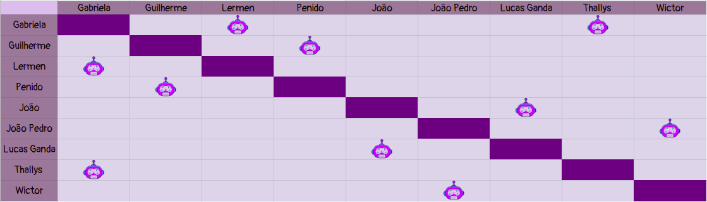

# Planejamento Sprint 13

**Data de Início**: 18/06/2019

**Data de Término**: 24/06/2019

**Duração**: Uma semana

**Pontos Planejados**: 32

-------

[1. Papéis](#_1-papéis)

[2. Planejamento das tarefas](#_2-planejamento-das-tarefas)

[3. Tarefas da _Sprint_](#_3-tarefas-da-sprint)  

  * [3.1. Planejadas](#_31-planejadas)

[4. Pareamentos](#_4-pareamentos_) 

-------

## 1. Papéis

**Tech Leader**: Lucas Lermen

**Product Manager**: Gabriela Moraes

**DevOps**: Guilherme Siqueira

**Arquiteto de Software**: Lucas Penido

## 2. Planejamento das tarefas

 Para que o planejamento possa ser cumprido, o problema ocorrido com o ambiente de homologação deve ser corrigido, com o objetivo de permitir a entrada de novas histórias nesse ambiente. Assim sendo, o bom andamento da <i>sprint</i> depende da correção desse problema.

## 3. Tarefas da _Sprint_

### 3.1. Planejadas

|Tarefas|Pontos|
|-|:--:|
| **Dívida** US20 - Visualizar tutoriais da comunidade | 5 |
| **Dívida** US22 - Acessar tutorial da comunidade | 8 | 
| **Dívida** US10 - Recomendar Materiais | 5 |
| **Dívida** US08 - Informar sobre formas de contribuição com conteúdo| 2 |
| T61 -Refatorar documentação | 5 |
| T62 - Refatorar aplicação ReactJS | |
| T63 -Corrigir fluxo de tutorial| 5 |
| T64 -Ajustar fluxo de ambiente | 3 |
| T65 -Ajustar o fluxo de FAQ | 3 |
| T66 - Documentar sprint | 1 |
| T67 - Refatorar conversas e intents | 3 |

## 4. Quadro de pareamento

