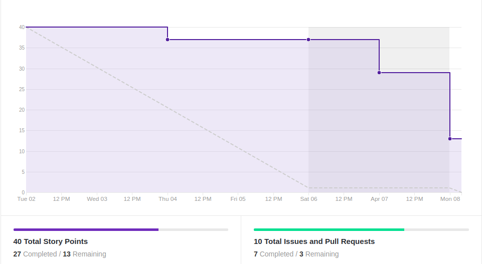
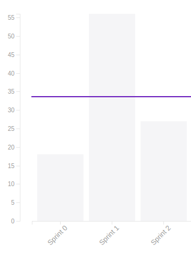

# Resultado Sprint 2

## 1. Indicadores de Qualidade do Processo

### 1.1 Fechamento da _Sprint_

**Pontos Concluídos:** 27

|Tarefas | Status |
|--|--|
| T18 | Concluída |
| T19 | Concluída |
| T20 | Concluída |
| T21 | Concluída |
| T22 | Não concluída |
| T23 | Não concluída |
| T24 | Concluída |
| S04 | Concluída |

### 1.2 _Burndown_

### 1.3 _Velocity_

### 1.4 Retrospectiva

|Membro|Pontos Positivos|Pontos Negativos|Sugestões de melhoria| Pontuação das histórias |
|---|------|-----|---|---|
|Gabriela Moraes|Ideias iniciais sobre os microsserviços do projeto e Docker iniciado |Entregas significativas de outras disciplinas afetaram as atividades da sprint gerando dividas |Analisar se algum dos integrantes tem entregas importantes de outras disciplinas que possam afetar as entregas da sprint e levar em conta no planejamento|Adequada|
|Guilherme Siqueira| Luz no desenvolvimento da arquitetura e desenvolvimento do Docker|Muitos trbalhos e provas de outras matérias afetando desempenho da equipe|- |Adequada
|Lucas Lermen| Docker foi bem adiantado | Muitos trabalhos de outras matérias | - | Correta |
|Lucas Penido| Iniciação do Docker, protótipo feito | Provas de outra matéria e estágio ocupam muito tempo | - | Correta |
|João de Assis|Conhecimento sobre o projeto/pygame |Provas chegando/trabalhos de outras matérias | - |Correta
|João Pedro|Conhecimento sobre microsserviços e pygame|Dificuldade de conciliar MDS com as outras matérias | - | Adequada|
|Lucas Ganda| Ter mais noção do escopo do projeto|Outras matérias tomando tempo| - | Adequada|
|Thallys Braz|Conhecimento de microsserviços | Pouco tempo pra fazer MDS por estar com outras disciplinas| - | Achei adequada
|Wictor Girardi|Melhorias de conhecimento a respeito do projeto|Tempo corrido |-|Achei adequada

### 1.5 Quadro de Conhecimento

##### Quadro de conhecimento inicial

##### Quadro de conhecimento final

## 2. Análise do _Tech Leader_

A presente <i>sprint</i> foi pontuada em 40 pontos e desses foram entregues 27.

Durante a <i>sprint</i>, reuniões diárias ocorreram via <i>Slack</i>, contando com a presença de praticamente todos os membros das equipes na maior parte delas. Essas reuniões serviram para que os integrantes pudessem informar sobre suas complicações durante a semana, o que culminou em dividas para a próxima <i>sprint</i> .

O <i>Burndown</i> da <i>sprint</i> auxiliou a evidenciar essas complicações, já que muitas tarefas foram entregues no final da <i>sprint</i> e outras duas não foram concluídas.

No quadro de conhecimento houveram pequenas melhoras em alguns pontos esporádicos. Porém, a equipe de planejamento acredita que as melhoras no conhecimento tendem a ser mais constantes a partir da próxima <i>sprint</i>.

 Duas tarefas - aprimoramento do Documento de Arquitetura e criação da identidade visual - não foram completadas e serão realizadas na próxima <i>sprint</i> do projeto.
