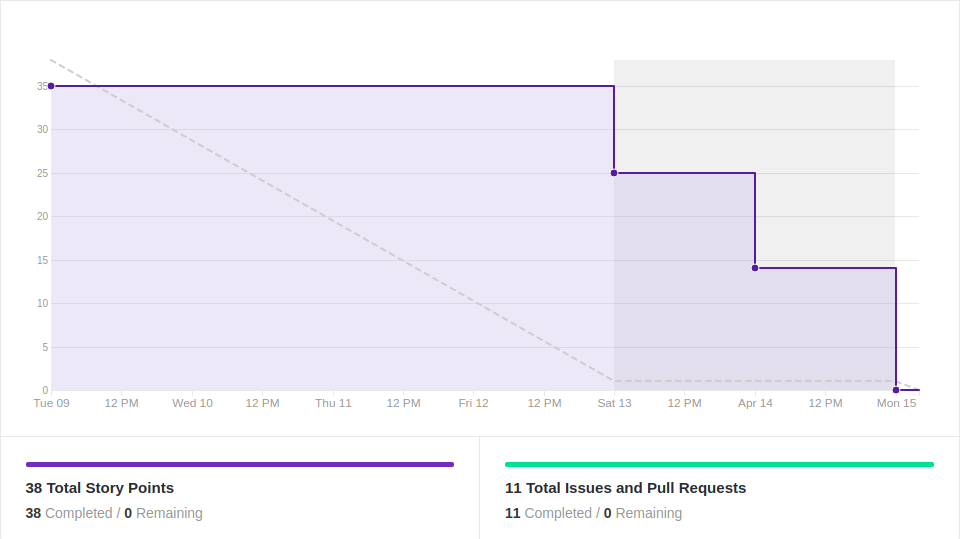
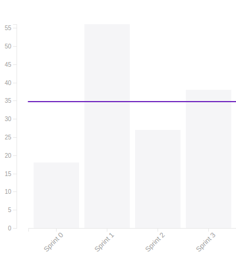

# Resultado Sprint 3

## 1. Indicadores de Qualidade do Processo

### 1.1 Fechamento da _Sprint_

**Pontos Concluídos:** 38

|Tarefas | Status |
|--|--|
| T22 | Concluída |
| T23 | Concluída |
| T25 | Concluída |
| T26 | Concluída |
| T27 | Concluída |
| T28 | Concluída |
| T29 | Concluída |
| US01 | Concluída |
| US02 | Concluída |

### 1.2 _Burndown_

### 1.3 _Velocity_

### 1.4 Retrospectiva

|Membro|Pontos Positivos|Pontos Negativos|Sugestões de melhoria| Pontuação das histórias |
|---|------|-----|---|---|
|Gabriela Moraes| Identidade visual e integração continua concluídas | Falhas de comunicação entre EPS/MDS | Melhorar o diálogo para evitar eventuais atrasos | A identidade visual demandou mais que o pontuado |
|Guilherme Siqueira|Identidade visual definida e integração contínua configurada|Comunicação entre membros para melhor resolução de issues|Forçar diálogos mesmo que pareça desnecessário|Identidade visual incoerente
|Lucas Lermen|Integração contínua configurado | Primeira sprint de código para MDS deu problemas| - |A identidade visual foi subestimada|
|Lucas Penido| Configuração da Integração contínua | Falta de comunicação entre a equipe, retrabalho | Tornar a equipe mais comunicativa | Identidade visual demorou mais do que o esperado |
|João de Assis|Finalização da feature, novos conhecimentos em telebot e docker|Problemas com o docker||Adequada
|João Pedro|Novos conhecimentos em rasa, telebot e docker|Problemas com o Git e na formatação do código||Adequada|
|Lucas Ganda|Finalizacao da feature|Problemas com o codigo ||Adequada|
|Thallys Braz|Finalizar mais um documentos|Um pouco de falta de pratica com git| --- | Adequada
|Wictor Girardi|Conhecimentos com o docker e o flake8 melhorados|Alguns problemas com o código|--|Adequada

### 1.5 Quadro de Conhecimento

##### Quadro de conhecimento inicial

##### Quadro de conhecimento final

## 2. Análise do _Tech Leader_

A presente <i>sprint</i> foi pontuada em 38 pontos e todos foram entregues.

Durante a <i>sprint</i>, reuniões diárias ocorreram via <i>Slack</i>, e a maioria dos membros foi presente nessas reuniões. Por ser a primeira <i>sprint</i> de código, as reuniões serviram para a equipe de EPS acompanhar o progresso dos membros de MDS e ajudá-los quando foi necessário. O membro João de Assis foi o que mais acumulou faltas porém, através dos informes de seu pareamento, João Pedro, foi possível acompanhar o andamento da sua história.

O <i>Burndown</i> da <i>sprint</i> mostrou que a equipe teve mais disponibilidade de trabalhar com o projeto mais próximo ao final dessa <i>sprint</i>, devido ao fato dele coincidir com o final de semana. Atrelado a isso, existe a dificuldade inicial com o código e com a resolução de conflitos no GitHub.

No quadro de conhecimento houveram melhoras em relação ao Python e ao funcionamento do ChatBot do telegram. Tal fato é um reflexo do início dos trabalhos com código. Já a equipe de EPS não evoluiu em nenhuma das tecnologias pois não teve contato com as mesmas na <i>sprint</i>

 Foi uma <i>sprint</i> positiva para o time que pode iniciar, por fim, o desenvolvimento do Ludum.

