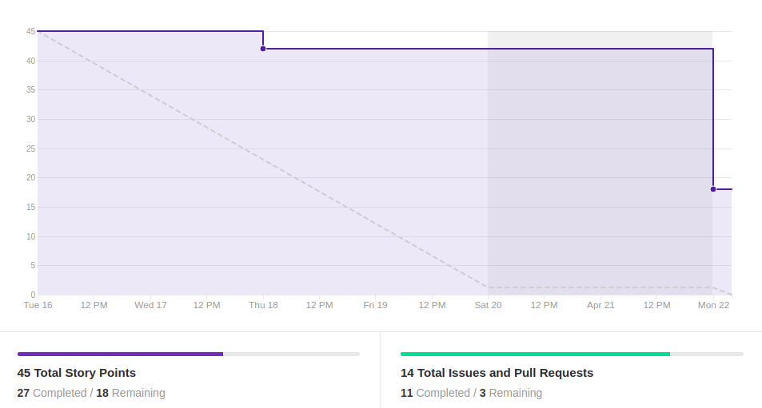
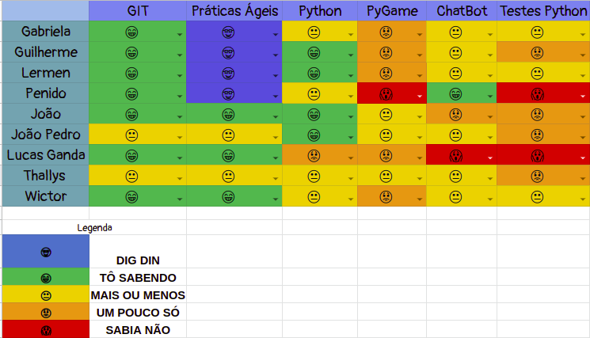
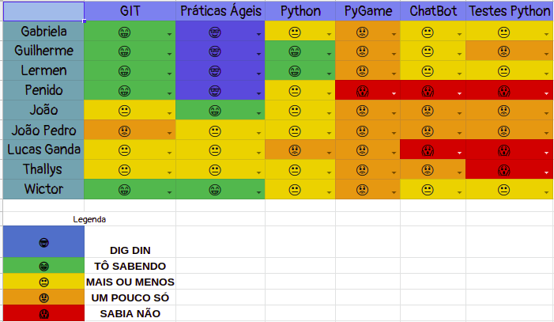

# Resultado Sprint 4

## 1. Indicadores de Qualidade do Processo

### 1.1 Fechamento da _Sprint_

**Pontos Concluídos:** 27

|Tarefas | Status |
|--|--|
| TS01 | Não Concluída |
| US03 | Concluída |
| US04 | Concluída |
| US05 | Concluída |
| US06 | Concluída |
| US07 | Não Concluída |
| T30 | Concluída |
| T31 | Concluída |
| T32 | Concluída |
| T33 | Não Concluída |

### 1.2 _Burndown_

### 1.3 _Velocity_

### 1.4 Retrospectiva

|Membro|Pontos Positivos|Pontos Negativos|Sugestões de melhoria| Pontuação das histórias |
|---|------|-----|---|---|
|Gabriela Moraes|Revisão da arquitetura e novos microsserviços definidos|Tarefas de outras disciplinas impactaram nas entregas o que acabou gerando dívidas|Adicionar pequenas práticas que buscam melhorar a comunicação| Adequada|
|Guilherme Siqueira|Uso do rasa e arquitetura definida |Muitos problemas imprevistos no docker |Comunicação |Adequada
|Lucas Lermen| Uso do rasa e arquitetura definida | Infelizmente o documento de arquitetura e a modelagem do banco de dados ficaram de dívidas | Melhorar comunicação | Adequadas |
|Lucas Penido| Arquitetura definida e avanço no rasa | Não finalização do documento de arquitetura e da modelagem do banco de dados | Melhorar a comunicação e acompanhar mais de perto os MDS | Adequada |
|João de Assis|Melhorias com Rasa, maior entendimento sobre chatbot |Problemas com Rasa/Docker |Melhorar comunicação e organização de MDS |Não adequada
|João Pedro| Conhecimento em Rasa e entendimento do bot|Entender o rasa, problemas com o docker, falta de experiencia minha com git e atividades de outras matérias | Melhorar a comunicação e organização por parte dos MDS |Adequada|
|Lucas Ganda| Entendimento de como funciona melhor o bot|Refatoracao da US e entendimento do rasa |Integracao entre os membros | Nao adequada|
|Thallys Braz| Todos de MDS começa a codar| Dificuldade com o rasa| Melhorar a integração do grupo | Não adequada
|Wictor Girardi|Melhorias do coonhecimento em Rasa, desenvolvimento da equipe de MDS| Dificuldade em Rasa, refatoração do projeto, problemas com token| Maior integração e comunicação entre a equipe| Não adequada

### 1.5 Quadro de Conhecimento

##### Quadro de conhecimento inicial

##### Quadro de conhecimento final

## 2. Análise do _Tech Leader_

A presente <i>sprint</i> foi pontuada em 45 pontos e desses foram entregues 27. Foi uma <i>sprint</i> que ocorreram algumas complicações em referentes ao conhecimento sobre as tecnologias usadas. Dessa forma a equipe não conseguiu ser ágil e nem efetiva.

 Durante asreuniões diárias que ocorreram via <i>Slack</i>, essas dificuldades foram expostas e, durante <i>sprint</i> as mesmas foram trabalhadas para que algumas tarefas conseguissem ser entregues.

O <i>Burndown</i> demonstra essas dificuldades ao apresentar a maior parte de sua descida no último dia da <i>sprint</i>, além de explicitar os 18 pontos não concluídos da sprint.

No quadro de conhecimento foram adicionadas as tecnologias inseridas no projeto(RASA e Docker). Além disso, ocorreram melhoras na parte que envolve o Python e a criação de Chatbot

 Foi uma <i>sprint</i> complicada, mas que uniu mais o time para a sequência do trabalho.

