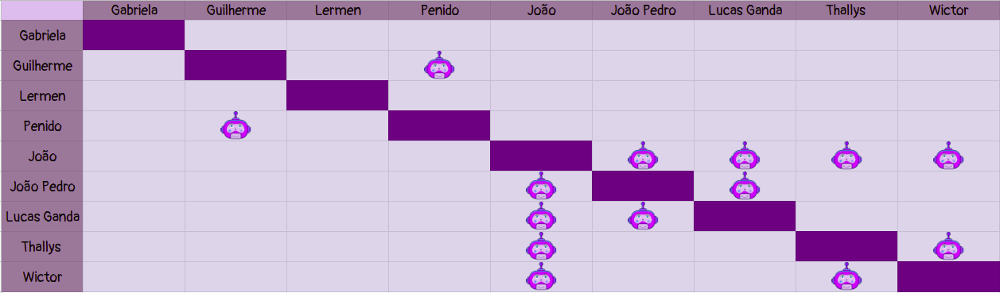

# Planejamento Sprint 5

**Data de Início**: 23/04/2019

**Data de Término**: 29/04/2019

**Duração**: Uma semana

**Pontos Planejados**: 43

-------

[1. Papéis](#_1-papéis)

[2. Planejamento das tarefas](#_2-planejamento-das-tarefas)

[3. Tarefas da _Sprint_](#_3-tarefas-da-sprint)  

  * [3.1. Planejadas](#_31-planejadas)

[4. Pareamentos](#_4-pareamentos_)  

-------

## 1. Papéis

**Tech Leader**: Lucas Lermen

**Product Manager**: Gabriela Moraes

**DevOps**: Guilherme Siqueira

**Arquiteto de Software**: Lucas Penido

## 2. Planejamento das tarefas

 As tarefas foram planejadas levando em consideração as complicações ocorridas na <i>sprint</i> passada, e o fato de a Release 1 do projeto estar se aproximando. Assim sendo, foram planejados 43 pontos(valor um pouco acima do velocity), divididos em tarefas cruciais para garantir a viabilidade técnica do projeto. 

## 3. Tarefas da _Sprint_

### 3.1. Planejadas

|Tarefas|Pontos|
|-|:--:|
| T33 - Finalizar documento de arquitetura | 8 |
| US07 - Eu, como usuário, desejo que o Ludum pergunte sobre o meu ambiente de desenvolvimento | 5 |
| T34 - Ajustar documentos | 3 |
| T36 - Eu, como desenvolvedor, desejo refinar a comunicação do Ludum para torna-lá mais fluída | 5 |
| TS06 - Eu, como desenvolvedor, desejo criar um microsserviço que realize a comunicação com o core do Ludum | 5 |
| TS07 - Eu, como desenvolvedor, desejo comunicar o microsserviço de perguntas e respostas com o StackOverflow | 8 |
| T35 - Documentar Sprint | 1 |
| TS17 - Eu, como desenvolvedor, desejo modelar o banco de dados do microsserviço de conexão com o StackOverflow. | 3 |
| TS18 - Eu, como desenvolvedor, desejo implementar o banco de dados do microsserviço de conexão com StackOverflow. | 5 |

## 4. Pareamentos

