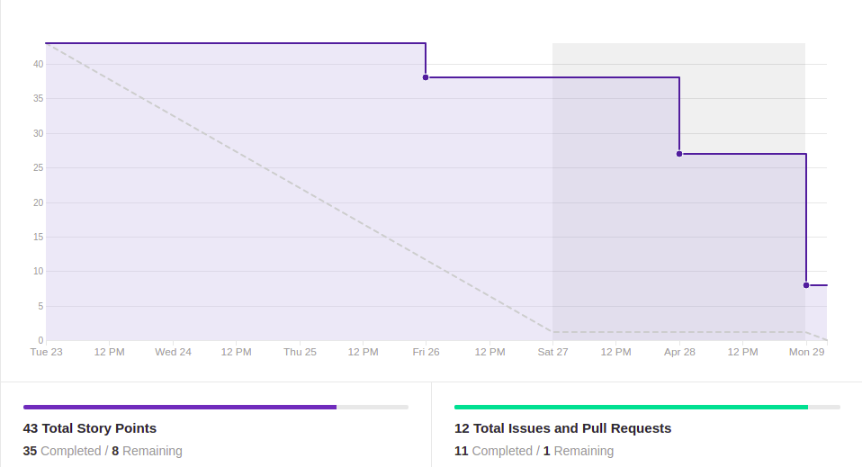
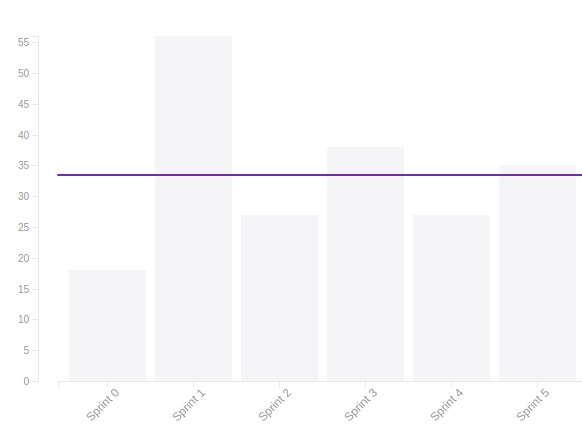

# Resultado Sprint 5

## 1. Indicadores de Qualidade do Processo

### 1.1 Fechamento da _Sprint_

**Pontos Concluídos:** 35

|Tarefas | Status|
|--|--|
| T33 | Não concluída |
| T34 | Concluída |
| T35 | Concluída |
| T36 | Concluída |
| US07 | Concluída |
| TS06 | Concluída |
| TS07 | Concluída |
| TS17 | Concluída |
| TS18 | Concluída |

### 1.2 _Burndown_

### 1.3 _Velocity_

### 1.4 Retrospectiva

|Membro|Pontos Positivos|Pontos Negativos|Sugestões de melhoria| Pontuação das histórias |
|---|------|-----|---|---|
|Gabriela Moraes| Arquitetura refatorada e mais definida o que permitiu a reorganização do backlog e criação do microsserviço do stackoverflow| A alteração na arquitetura gerou um atraso na realização de ajustes no documento de arquitetura |- | Adequada
|Guilherme Siqueira| Validação da arquitetura com professora e microsserviço de dúvida bem adiantado | Falta de tempo de alguns membros do grupo devido provas | - |Adequada
|Lucas Lermen| Arquitetura foi definida de maneira mais correta com auxílio da professora Milene| Infelizmente faltaram alguns pontos do documento de arquitetura para a tarefa ser concluída | -  | Adequada |
|Lucas Penido| Realizar requisições para a API do Stackoverflow | Dificuldade com a comunicação com o banco de dados | - | Bem definida |
|João de Assis|Consegui ajudar os 2 pareamentos| Bugs diversos||Justa
|João Pedro|Mais conhecimento com Rasa |Dificuldade com Slots | |Adequada|
|Lucas Ganda| Conhecimentos de Rasa melhorados|Nenhum |-- | Justa|
|Thallys Braz| Conhecimento um pouco melhor de RASA|BUGS com Slots |-- |de certa forma justa
|Wictor Girardi|Conhecimento melhorado a cerca do RASA e Docker |Muitos Bugs em relação ao uso de slots e da historia US07 |--| Justa

### 1.5 Quadro de Conhecimento

##### Quadro de conhecimento inicial

##### Quadro de conhecimento final

## 2. Análise do _Tech Leader_

Devido as complicações da <i>sprint</i> anterior, a atual foi pontuada em 45 pontos para que a equipe pudesse recuperar o atraso. Foi um risco calculado tendo em vista que boa parte da equipe estava com a semana mais leve.

As reuniões diárias da equipe constataram esse fato, já que a equipe pode relatar que estava sempre realizando as tarefas do projeto. O <i>Burndown</i> É uma evidência disso também, já que a equipe conseguiu entregas contínuas durante a <i>sprint</i>.

Porém, ocorreram definições importantes acerca da arquitetura, o que impossibilitou a sua conclusão, deixando assim uma dívida técnica da <i>sprint</i>.

 Foi uma <i>sprint</i> produtiva, a qual deixa o caminho bem direcionado para a primeira Release.

