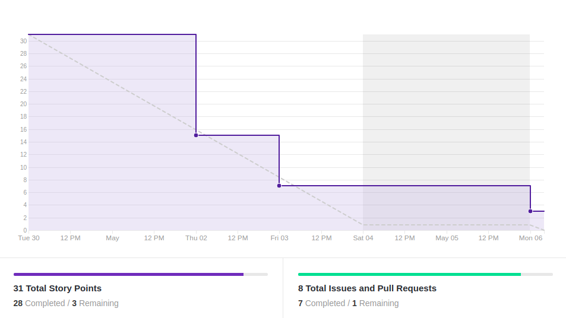
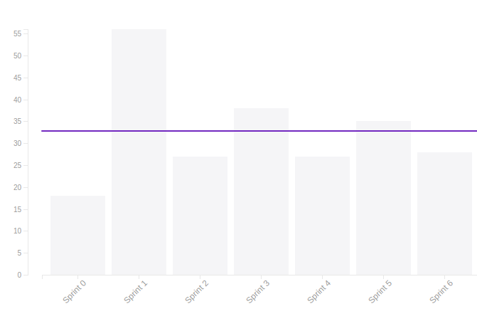
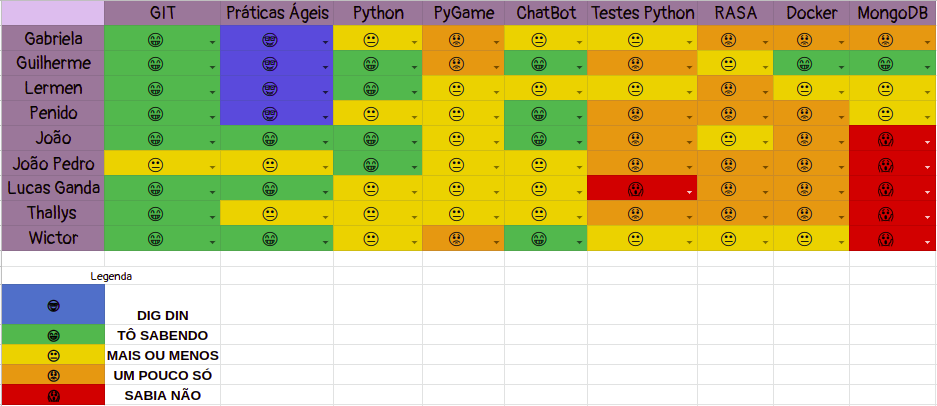
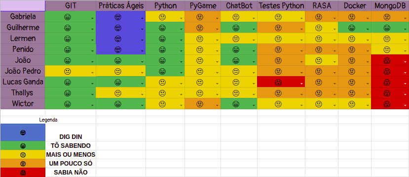

# Resultado Sprint 6

## 1. Indicadores de Qualidade do Processo

### 1.1 Fechamento da _Sprint_

**Pontos Concluídos:** 28

|Tarefas | Status |
|--|--|
| T33 | Concluída |
| T34 | Concluída |
| T35 | Concluída |
| T36 | Concluída |
| T37 | Concluída |
| US16| Concluída |
| BUG01 | Não concluído  |

### 1.2 _Burndown_

### 1.3 _Velocity_

### 1.4 Retrospectiva

|Membro|Pontos Positivos|Pontos Negativos|Sugestões de melhoria| Pontuação das histórias |
|---|------|-----|---|---|
|Gabriela Moraes| As histórias que eram necessárias para R1 foram entregues|Bugs muito difíceis de resolver| Ajustar aspectos de acordo com o feedback dado na R1| Adequada
|Guilherme Siqueira|"Viabilidade técnica foi provada" | VM na Amazon caiu no dia da R1 | Migrar pra uma VM melhor (na própria Amazon ou Digital Ocean) | O deploy exigiu mais que o pontuado
|Lucas Lermen| Praticamente tudo foi finalizado a tempo da R1 | O bug está irritando muito | - | Justa |
|Lucas Penido| Quase tudo foi finalizado para a R1 | Críticas ao projeto, bug | Distribuição melhor de atividades | Justa |
|João de Assis| Apresentação da R1|O bug irritante e a apresentação da R1 | |Justa
|João Pedro|Apresentação da R1|Apresentação da R1 e bugs|--- |Justa|
|Lucas Ganda| Apresentacao da R1 | O bug o projeto |---| Adequada|
|Thallys Braz|Apresentação da R1 |Apresentar a R1|--- |Adequada
|Wictor Girardi|R1 realizada com sucesso | Bugs |--| Adequada

### 1.5 Quadro de Conhecimento

##### Quadro de conhecimento inicial

##### Quadro de conhecimento final

## 2. Análise do _Tech Leader_

Foi uma <i>sprint</i> atípica, onde se englobou a realização da apresentação da primeira. Dessa forma, a grande parte dos esforços estavam voltados para a preparação da apresentação. Ou seja, a maioria das tarefas consistia de ajustar os detalhes para a apresentação.

Praticamente tudo planejado foi entregue, com exceção de um bug na funcionalidade de busca de perguntas no StackOverFlow. Essa é uma tarefa que irá demorar mais tempo do que o planejado.

 Após a apresentação da Release, a equipe recebeu um direcionamento para caminhar com o projeto da maneira mais correta.
