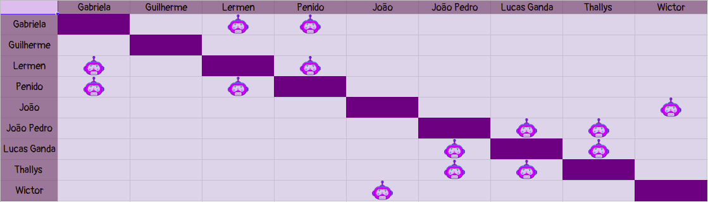

# Planejamento Sprint 7

**Data de Início**: 07/05/2019

**Data de Término**: 13/05/2019

**Duração**: Uma semana

**Pontos Planejados**: 31
-------

[1. Papéis](#_1-papéis)

[2. Planejamento das tarefas](#_2-planejamento-das-tarefas)

[3. Tarefas da _Sprint_](#_3-tarefas-da-sprint)  

  * [3.1. Planejadas](#_31-planejadas)

[4. Pareamentos](#_4-pareamentos_) 

-------

## 1. Papéis

**Tech Leader**: Lucas Lermen

**Product Manager**: Gabriela Moraes

**DevOps**: Guilherme Siqueira

**Arquiteto de Software**: Lucas Penido

## 2. Planejamento das tarefas

 As tarefas dessa <i>sprint</i> foram planejadas para o descanso da equipe, resultando em uma semana mais leve, com foco nas correções do projeto de acordo com o que foi apontado na apresentação da primeira Release.

## 3. Tarefas da _Sprint_

### 3.1. Planejadas

|Tarefas|Pontos|
|-|:--:|
| **Dívida** BUG01 - Action do Microsserviço Dúvidas com problema | 8 |
| T38 - Redefinir escopo de acordo com as recomendações da R1 | 2 |
| T39 - Corrigir backlog de acordo com as recomendações da R1 | 5 |
| T40 - Corrigir documentação das issues de acordo com as recomendações da R1 | 5 |
| T41 - Migrar deploy para máquina virtual de maior capacidade | 5 |
| T42 - Criar Release Notes| 2 |
| T44 - Refatorar os diálogos do bot de acordo com recomendações da R1 | 3 |
| T43 - Documentar Sprint | 1 |

## 4. Pareamentos

