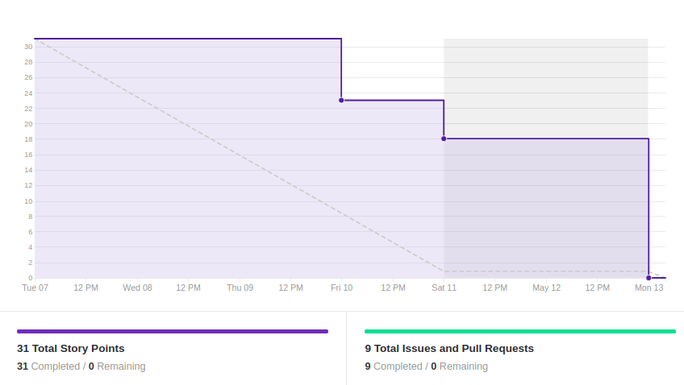
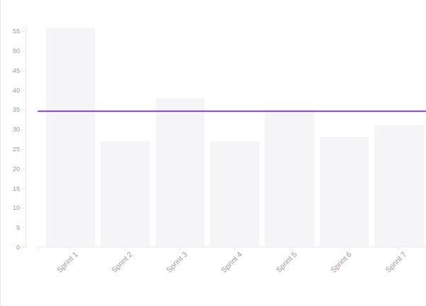

# Resultado Sprint 7

## 1. Indicadores de Qualidade do Processo

### 1.1 Fechamento da _Sprint_

**Pontos Concluídos:** 31

|Tarefas | Status|
|--|--|
| BUG01 | Concluído |
| T38 | Concluída |
| T39 | Concluída |
| T40 | Concluída |
| T41 | Concluída |
| T42 | Concluída |
| T43 | Concluída |

### 1.2 _Burndown_

### 1.3 _Velocity_

### 1.4 Retrospectiva

|Membro|Pontos Positivos|Pontos Negativos|Sugestões de melhoria| Pontuação das histórias |
|---|------|-----|---|---|
|Gabriela Moraes| Resolução do novo escopo e do backlog | Semana muito cheia de compromissos de outras matérias|-| Adequada
|Guilherme Siqueira| Migração do deploy e diminuição do escopo | Sprint com poucas histórias. Membros ficaram ociosos no meio da sprint | - | Adequada 
|Lucas Lermen| O escopo e o backlog foram redefinidos | A semana com diversos trabalhos atrapalhou a execução de algumas atividades | - | Adequada |
|Lucas Penido|Diminuição do escopo | Não participação por incompatibilidade dos horários | - | Adequada |
|João de Assis|Correção do bug |Poderia ter feito mais coisas na sprint | |Adequada
|João Pedro|Melhorias do dialogo|Falta de tempo da minha parte, provas e trabalho|-- | Adequada|
|Lucas Ganda|Melhoria dos dialogos | Nenhum | -- | Adequada |
|Thallys Braz|Melhoria nos dialogos do Bot|--|-- |adequada
|Wictor Girardi|Melhorias e alguns bugs corrigidos |Trabalhos de outras materias e provas|--| Adequada

### 1.5 Quadro de Conhecimento

##### Quadro de conhecimento inicial

##### Quadro de conhecimento final

## 2. Análise do _Tech Leader_

Para essa <i>sprint</i> foi planejado uma menor quantidade de trabalho, tendo em vista os esforços da equipe para realizar uma boa entrega para a primeira Release. Dessa forma, foi decidido que os membros da equipe mereciam uma semana mais leve para recuperar as energias.

Essa escolha por uma <i>sprint</i> com menos trabalho fez com que todo o planejado fosse entregue. Isso é apresentado através do <i>burndown</i>, que mostra uma sequência de entregas constantes.

 De algumas <i>sprints</i> até agora o quadro de conhecimento demonstra que a equipe aumentou seu conhecimento nas tecnologias referentes ao projeto, ou seja, praticamente elimina o risco de uma dessas tecnologias afetar negativamente o andamento do projeto. Os riscos em relação ao ambiente de desenvolvimento foram eliminados e também foi observado que a comunicação da equipe melhorou significativamente.

 O projeto está bem encaminhado e os membros da equipe com uma ótima noção do mesmo.
