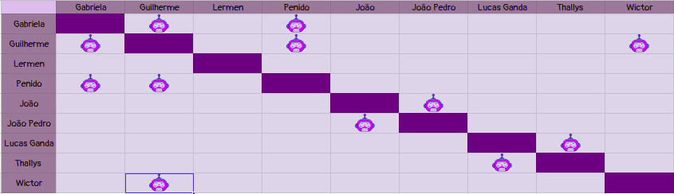

# Planejamento Sprint 8

**Data de Início**: 14/05/2019

**Data de Término**: 20/05/2019

**Duração**: Uma semana

**Pontos Planejados**: X

-------

[1. Papéis](#_1-papéis)

[2. Planejamento das tarefas](#_2-planejamento-das-tarefas)

[3. Tarefas da _Sprint_](#_3-tarefas-da-sprint)  

  * [3.1. Planejadas](#_31-planejadas)
  
[4. Pareamentos](#_4-pareamentos_) 

-------

## 1. Papéis

**Tech Leader**: Lucas Lermen

**Product Manager**: Gabriela Moraes

**DevOps**: Guilherme Siqueira

**Arquiteto de Software**: Lucas Penido

## 2. Planejamento das tarefas

 Após uma <i>sprint</i> com planejamento mais leve devido a R1, a equipe voltará a trabalhar com força para manter o bom andamento do projeto. Para isso foram planejados 50 pontos de esforço, divididos entre tarefas para colocar em funcionamento funcioalidades vitais do Ludum

## 3. Tarefas da _Sprint_

### 3.1. Planejadas

|Tarefas|Pontos|
|-|:--:|
| TS08 Eu, como desenvolvedor, desejo criar um jogo de baixa complexidade para elaborar o tutorial | 5 |
| TS09 - Eu, como desenvolvedor, desejo criar um jogo de complexidade um pouco mais alta para elaborar o tutorial | 8 |
| Adicionar Inlines keyboard ao menu principal e ao menu de seleção de tutorial| 5 |
| US12 - Eu, como usuário, desejo pesquisar minha dúvida no StackOverflow caso ela não esteja presente no FAQ | 8 |
| US13 - Eu, como usuário, desejo selecionar a complexidade do jogo em que receberei auxílio | 2 |
| TS10 - Eu, como desenvolvedor, desejo modelar o banco de dados do microsserviço de links e tutoriais. | 2 |
| TS11 - Eu, como desenvolvedor, desejo implementar o banco de dados do microsserviço de links e tutoriais. | 3 |
| TS04 - Eu, como desenvolvedor, desejo popular o banco com links interessantes| 3 |
| TS14 - Eu, como desenvolvedor, desejo criar um endpoint para acesso aos links.| 5 |
| TS15 - Eu, como desenvolvedor, desejo criar um endpoint para acesso aos tutoriais| 5 |
| T45 - Criar docker para o microsserviço de links e tutoriais | 5 |
| T46 - Configurar a integração contínua para o microsserviço de links e tutoriais | 5 |
| T47 - Documentar sprint | 1 |

## 4. Pareamentos

