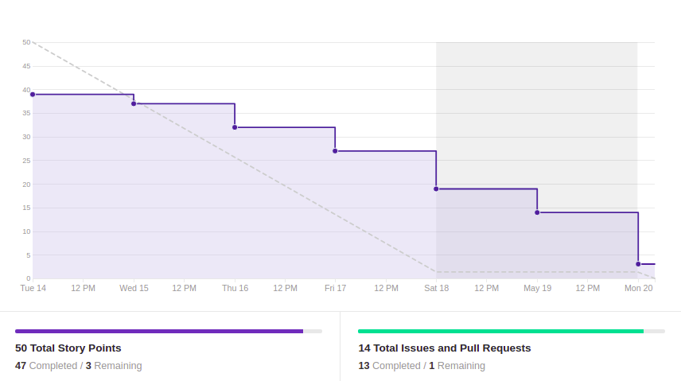
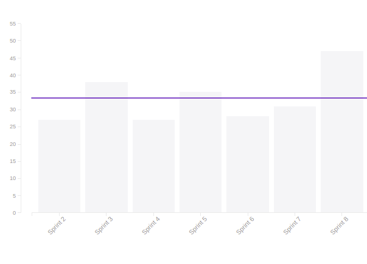
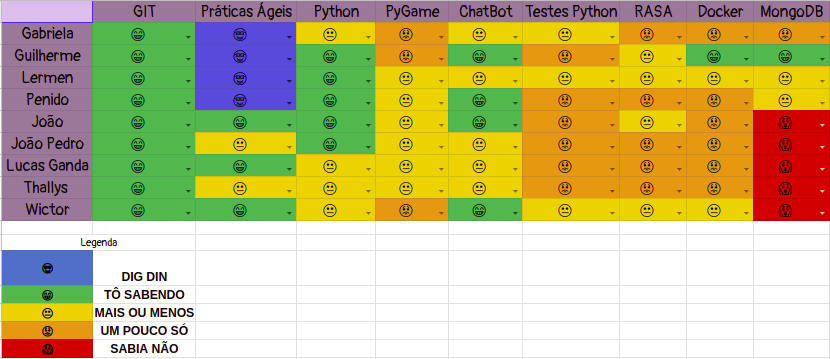

# Resultado Sprint 7

## 1. Indicadores de Qualidade do Processo

### 1.1 Fechamento da _Sprint_

**Pontos Concluídos:** 47

|Tarefas | Status|
|--|--|
| US12 | Concluída |
| US13 | Concluída |
| TS04 | Não Concluída |
| TS08 | Concluída |
| TS09 | Concluída |
| TS11 | Concluída |
| TS14 | Concluída |
| TS15 | Concluída |
| T45 | Concluída |
| T46 | Concluída |
| T47 | Concluída |
| T51 | Concluída |

### 1.2 _Burndown_

### 1.3 _Velocity_

### 1.4 Retrospectiva

|Membro|Pontos Positivos|Pontos Negativos|Sugestões de melhoria| Pontuação das histórias |
|---|------|-----|---|---|
|Gabriela Moraes| Histórias da funcionalidade principal do bot foram feitas e Microsserviço de Materiais progredindo de maneira positiva| Meu computador apresentou problemas durante a sprint e também foi descoberta uma limitação tecnológica em relação ao Tensorflow para o meu PC| - |Adequada
|Guilherme Siqueira|Microsserviço de materiais encaminhado | Não consegui estar presente como gostaria, pois sem tempo | Comunicação entre o time, evitando conversas privadas que comprometem a transparência do time | Ok
|Lucas Lermen| Banco do microsserviço de materiais e vários endpoints desses microsserviços foram implementados | Infelizmente não foi possível popular o BD(Dívida) | - | Adequadas |
|Lucas Penido| Mais um banco implementado e suas requisições criadas | Não cumpridmento do pareamento | - | Justa |
|João de Assis|Descobri novas funcionalidades do Rasa, melhorei os conhecimentos sobre as custom actions |Semana foi cansativa |- |Justa
|João Pedro|Novos conhecimentos e uma ideia melhorada de como vai ficar o bot final|Muitas tarefas de outras matérias|--|Adequada|
|Lucas Ganda| Conhecimento aprimorado de pygame| Nenhum |--- | |
|Thallys Braz|Aumentar o conhecimento em jogos|---|---|adequada
|Wictor Girardi|Descobri o uso de novas maneiras de comunicação com o bot e melhorias nele|---|---|Adequada

### 1.5 Quadro de Conhecimento

##### Quadro de conhecimento inicial

##### Quadro de conhecimento final

## 2. Análise do _Tech Leader_

A presente <i>sprint</i> foi a que a equipe teve uma das maiores sequências de entregas constantes de todo o projeto. O <i>burndown</i> deixa isso bem claro, mostrando que a equipe seguiu praticamente a linha de entrega ideal.

Esse fato se deve à eliminação de vários riscos, já citados no resultado da <i>sprint</i> anterior. Essas eliminações fazem com que a equipe trabalhe de maneira mais coesa e unificada, realmente como um time.

 O quadro de conhecimento também evidencia um conhecimento bem distribuído entre os membros da equipe, resultado de um funcionamento efetivo dos pareamentos.

 Novamente é importante ressaltar que o projeto está bem encaminhado e os membros da equipe com uma ótima noção do mesmo.
