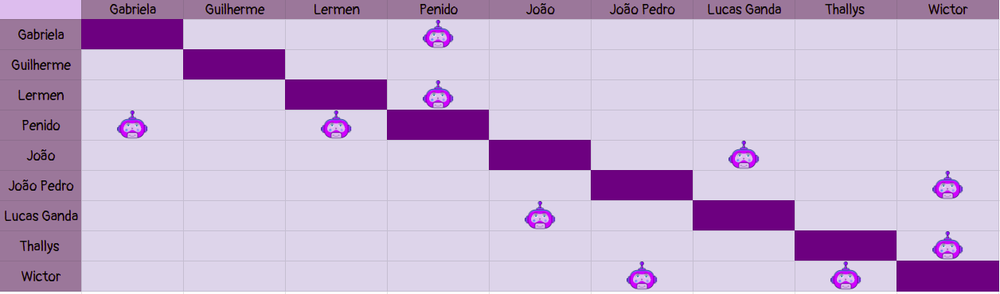

# Planejamento Sprint 8

**Data de Início**: 21/05/2019

**Data de Término**: 27/05/2019

**Duração**: Uma semana

**Pontos Planejados**: 55

-------

[1. Papéis](#_1-papéis)

[2. Planejamento das tarefas](#_2-planejamento-das-tarefas)

[3. Tarefas da _Sprint_](#_3-tarefas-da-sprint)  

  * [3.1. Planejadas](#_31-planejadas)
  
[4. Pareamentos](#_4-pareamentos_) 

-------

## 1. Papéis

**Tech Leader**: Lucas Lermen

**Product Manager**: Gabriela Moraes

**DevOps**: Guilherme Siqueira

**Arquiteto de Software**: Lucas Penido

## 2. Planejamento das tarefas

 As tarefas da <i>sprint</i> serão planejadas visando a continuidade do projeto. Assim sendo, elas são muito importantes para o funcionamento correto do Ludum.

 Foram planejados 55 pontos. É uma quantidade acima do velocity do projeto e boa parte dos membros só poderão trabalhar com suas partes no final da <i>sprint</i>. Apesar desses riscos, a equipe se comprometeu a entregar tudo o que foi planejado, tendo em vista a importância das tarefas planejadas.

## 3. Tarefas da _Sprint_

### 3.1. Planejadas

|Tarefas|Pontos|
|-|:--:|
| **Dívida** TS04 - Popular banco de dados com links | 3 |
| US11 - Visualizar FAQ | 5 |
| US14 - Aprender a criar um jogo de baixa complexidade | 5 |
| US15 - Aprender a criar um jogo de maior complexidade | 5 |
| US24 - Exibir lista de recomendações de ferramentas de desenvolvimento| 3 |
| TS03 - Criar endpoint de armazenamento de novos links | 5 |
| TS05 - Criar endpoint de edição de links | 5 |
| TS12 - Criar endpoint de edição de um tutorial | 5 |
| TS13 - Criar endpoint de armazenamento de novos tutoriais | 5 |
| Configurar deploy contínuo | 13 |
| Configurar deploy do microsserviço de tutoriais | 3 |
| Documentar sprint| 1 |

## 4. Pareamentos

