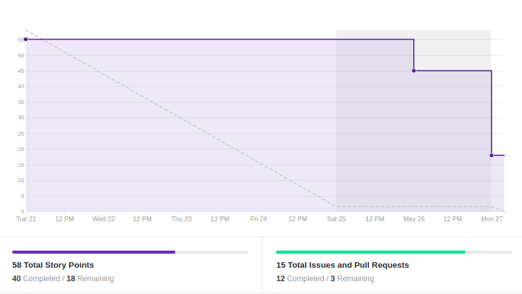
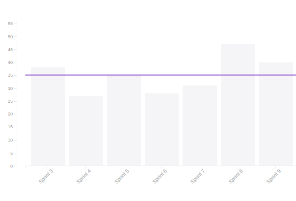
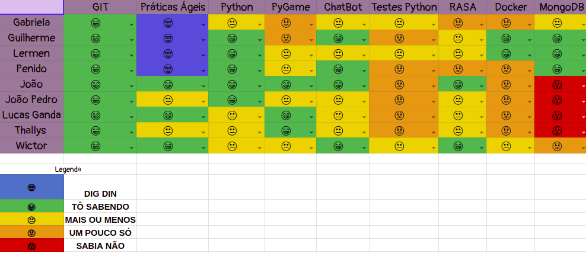
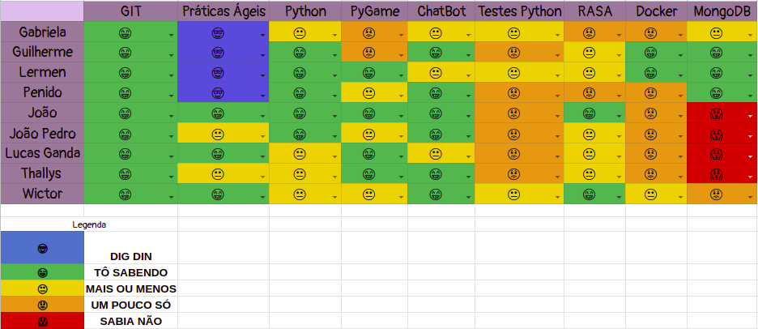

# Resultado Sprint 9

## 1. Indicadores de Qualidade do Processo

### 1.1 Fechamento da _Sprint_

**Pontos Concluídos:** 40

| Tarefas | Status |
|--|--|
| US11 | Concluída |
| US14 | Concluída |
| US15 | Não Concluída |
| US24 | Concluída |
| TS03 | Concluída |
| TS04 | Concluída |
| TS05 | Concluída |
| TS12 | Concluída |
| TS13 | Concluída |
| T48 | Concluída  |
| T49 | Não Concluída |
| T50 | Concluída |

### 1.2 _Burndown_

### 1.3 _Velocity_

### 1.4 Retrospectiva

|Membro|Pontos Positivos|Pontos Negativos|Sugestões de melhoria| Pontuação das histórias |
|---|------|-----|---|---|
|Gabriela Moraes| Todos os endpoints foram concluídos a tempo| Prova durante a sprint prejudicou a realização das histórias e houve uma pequena confusão quanto o conteúdo das issues dos endpoints|Revisar os conteúdos das issues para ver se já não foram cumpridos em outra e se está de acordo| As histórias dos endpoints demandaram menos do que o planejado
|Guilherme Siqueira|Microsserviço de Materiais bem adiantados |Problemas com o deploy contínuo utilizando o Rancher, cujo não conseguiu ficar pronto essa sprint |-  |Deploy contínuo deveria ter maior pontuação.
|Lucas Lermen| Endpoints todos realizados e o banco de dados populado | Alguns membros só conseguiram trabalhar no fim de semana | - | Pontuação dos endpoints foi superestimada |
|Lucas Penido| Endpoints concluidos | Falta de tempo de algumas pessoas do grupo por conta de provas |- | | Pontuação muito alta para os endpoints |
|João de Assis|Novas formas de buscar links com o bot|Prova durante a semana, adoeci no meio da sprint e perdi algum tempo | - | Adequada
|João Pedro| Deu pra realizar todas as tarefas a tempo|--- |--- | Adequada|
|Lucas Ganda|  | Provas durante a semana | --- | Adequada |
|Thallys Braz|Arrumar o bug do meu GIT|Bugs pra roda o bot|--|Adequada
|Wictor Girardi|Conhecimentos do RASA | Problemas com docker e planejamento pessoal errado para outras diciplinas| ---|Adequada

### 1.5 Quadro de Conhecimento

##### Quadro de conhecimento inicial

##### Quadro de conhecimento final

## 2. Análise do _Tech Leader_

Como citado no planejamento da presente <i>sprint</i>, boa parte dos membros da equipe só poderiam trabalhar na parte final da semana e esse foi um risco calculado. O <i>burndown</i> deixa esse aspecto bem claro. Assim sendo, a entrega da maior parte das tarefas foi um ponto positivo

Problemas de comunicação já não existem mais entre a equipe e os membros sempre estão cientes do andamento das outras partes do projeto. Além disso o conhecimento dos membros em relação as ferramentas de desenvolvimento já está bem difundido e os problemas em relação a isso são quase nulos.

Durante a sprint, parte da equipe notou que algumas issues ligadas a criação de endpoints necessitavam de passar por algumas alterações e esse problema foi rapidamente resolvido, o que mostra uma boa adaptação e compreensão da equipe em relação ao produto.

Um ponto do projeto que preocupa a equipe é a configuração do deploy contínuo. Essas configuração mostrou possuir uma dificuldade elevada e DevOps imagina que possa levar algum tempo para a conclusão dessa tarefa.

Após a sprint, é possível notar que o projeto está bem encaminhado e a resolução do problema envolvendo o deploy contínuo é um ponto crucial para a definição desse projeto.

