# Tutorial de como criar o jogo Pong

## 1 - Primeiramente, a criação da tela de fundo

```bash
Neste código abaixo, estamos primeiramente importando a pygame, definindo as cores, para então criar a tela com tamanho e nome
```
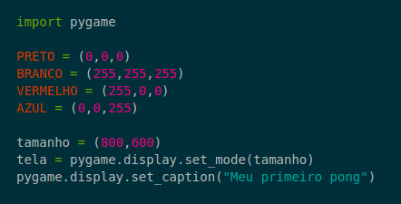1.1

```bash
Após isso, definimos que a tela só possa ser fechada, se o jogador fechar o programa
```
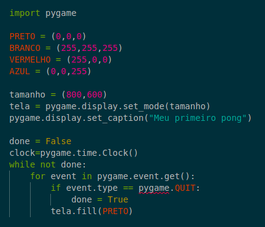1.2

### Este será o resultado
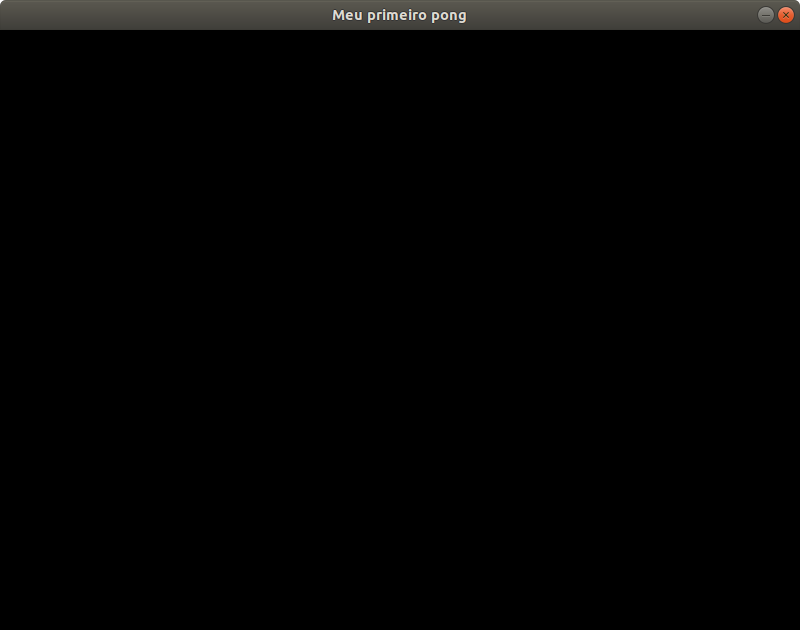1.3

## 2 - Agora vamos fazer a raquete

```bash
Primeiro, vamos definir abaixo da criação da tela[1.1], as coordenadas da raquete com "rect", criar a raquete e já definir que ela não pode sair da tela
```
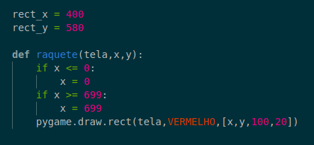2.1

```bash
Então mostraremos a raquete na tela
```
2.2

### Este será o resultado
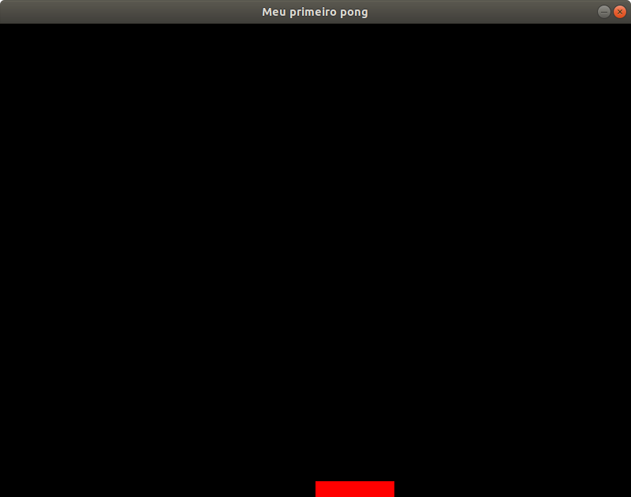2.3

## 3 - Vamos criar a bola

```bash
Primeiramente, vamos criar coordenadas iniciais quaisquer para a bolinha
```
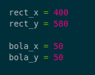3.1

```bash
Agora, vamos desenhar a bolinha na tela
```
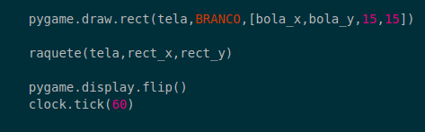3.2

### Este será o resultado
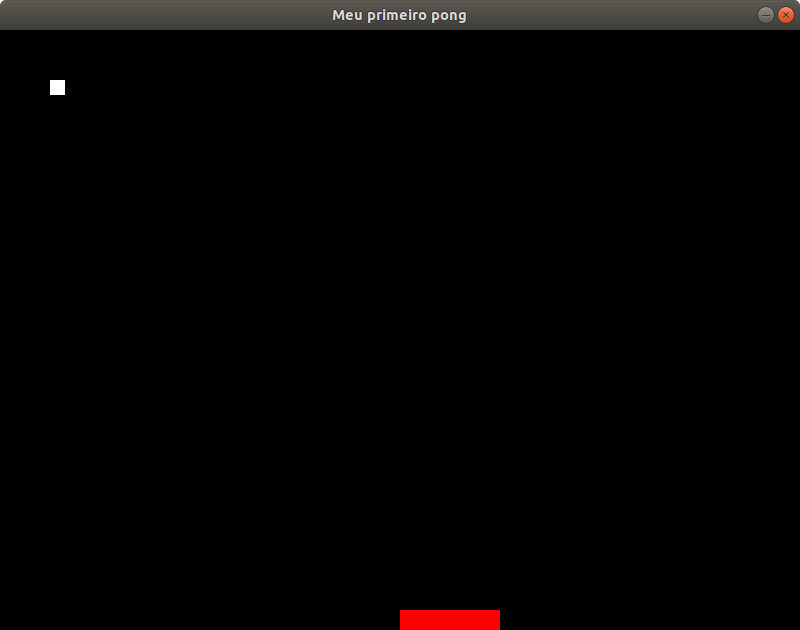3.3

## 4 - Vamos adicionar movimento à raquete

```bash
Começamos adicionando as coordenadas que alteraremos para movimentar a raquete
```
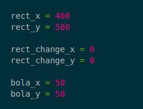4.1
 
 ```bash
Agora vamos adicionar movimento à raquete, fazendo com que as setas para direita e esquerda controlem a raquete
```
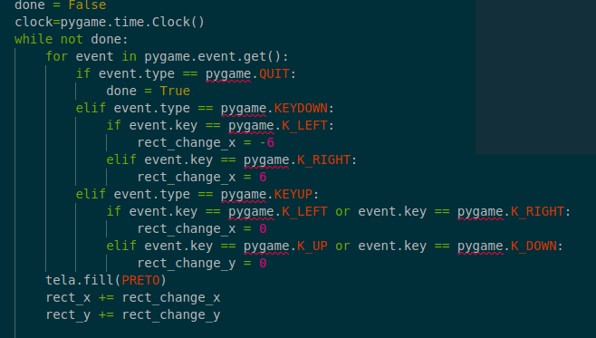4.2

### Este será o resultado
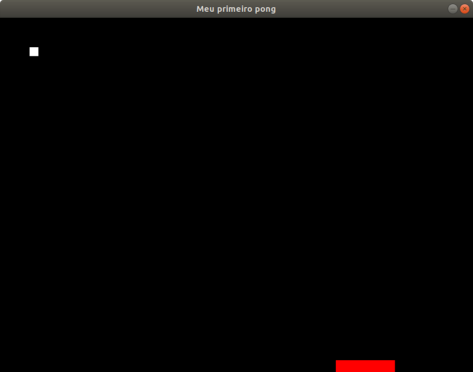4.3

## 5 - Agora adicionaremos movimento à bolinha

```bash
Começaremos adicionando as coordenadas que usaremos para dar movimento à bolinha
`````

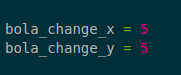5.1

```bash
Agora iremos mudar as coordenadas da bolinha para dar movimento a ela, já estabelecendo os limites da tela
````

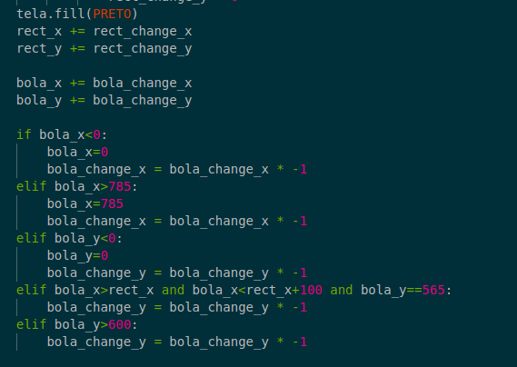5.2

### Este será o resultado
5.3


## 6 - Agora adicionaremos a biblioteca pygame para evitar erros no próximo passo

```bash
Primeiro vamos inicializar a biblioteca no começo do programa
````
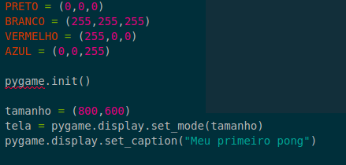6.1s

```bash
Agora vamos fechar a biblioteca no final do programa
````
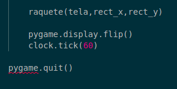6.2