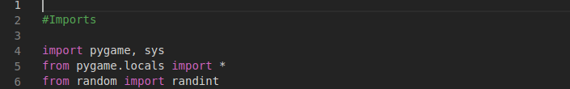

# Tutorial Jogo Snake 

# 1 - fazendo imports  

&emsp;&emsp;O primeiro passo para criar o jogo e fazermos os imports das bibliotecas necessárias, que nesse caso é a PyGame e a Random. Portanto, em código temos:

## 1.2 escolhendo cores

&emsp;&emsp;Nessa parte, definir as cores do jogo, que serão: Preto (<i>Black</i>), Azul (<i>Blue</i>) e Cinza (<i>Gray</i>), em código fica:

## 1.3 escolhendo as direções

&emsp;&emsp;Nessa parte, definir as direções de controle do jogo, que serão: Cima (<i>Up</i>), Baixo (<i>Down</i>), Esquerda (<i>Left</i>) e Direita (<i>Right</i>) em código fica:

